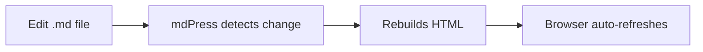
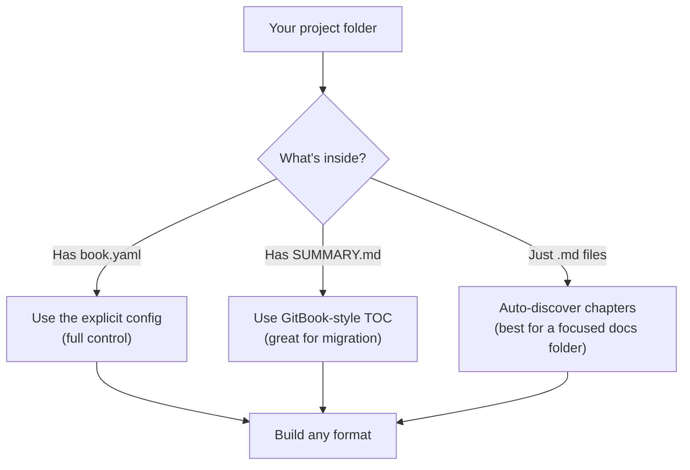

# mdPress

<p align="center">
  
</p>

[](https://go.dev/)
[](LICENSE)
[](https://github.com/yeasy/mdpress)

[中文说明](README_zh.md)

**Publish Markdown as a polished docs site, printable PDF, portable HTML, and ePub**.

```
$ mdpress build --format site,pdf,html,epub

  [1/5] Initializing theme system ... ✓ technical
  [2/5] Parsing chapters (4 top-level) ... ✓ 4 chapters
  [3/5] Generating cover and TOC ... ✓
  [4/5] Assembling HTML ... ✓
  [5/5] Generating output (site, pdf, html, epub) ... ✓

  ✅ Build completed (elapsed 845ms)
  ✓ Generated pdf   → /home/you/my-book/my-book.pdf
  ✓ Generated html  → /home/you/my-book/my-book.html
  ✓ Generated site  → /home/you/my-book/_book/index.html
  ✓ Generated epub  → /home/you/my-book/my-book.epub
```

Use `book.yaml` for full control, `SUMMARY.md` for GitBook-style projects, or zero-config discovery for a focused docs folder. For large repositories, point mdPress at the specific docs/book directory instead of the repo root.

## Why Teams Use mdPress

- **One source, multiple outputs**: build a docs site, a shareable HTML file, a PDF, and an ePub from the same Markdown project.
- **Fast writing loop**: `mdpress serve` gives you live preview, search, sidebar navigation, and dark mode while you edit.
- **Works with existing Markdown**: use `book.yaml`, `SUMMARY.md`, or a clean folder of Markdown files.
- **Fits publishing workflows**: migrate from GitBook/HonKit, export for review, or deploy the generated static site anywhere.

## Best Fit

- Technical documentation that needs a deployable static site and a printable PDF
- Internal handbooks and playbooks maintained in Git
- Guides and books that should also ship as HTML or ePub

## Showcase

### Technical Docs

- Theme: `technical`
- Best output: `site` + `pdf`
- Good for product docs, API guides, operations runbooks

### Team Handbook

- Theme: `minimal`
- Best output: `site` + `html`
- Good for onboarding, internal standards, process docs

### Book or Essay

- Theme: `elegant`
- Best output: `pdf` + `epub`
- Good for long-form writing, essays, and narrative documentation

### What the output looks like

`mdpress serve` generates a documentation site with sidebar navigation, chapter structure, and built-in themes:


`mdpress build --format site` produces a polished multi-page site, ready for hosting:


Generated sites include:

- full-text search with `Cmd/Ctrl+K`
- sidebar navigation and per-page table of contents
- dark mode

## Installation

### Homebrew (macOS)

```bash
brew tap yeasy/tap
brew install --cask mdpress
```

The Homebrew cask clears the macOS quarantine flag automatically, so Gatekeeper will not block it.

### Go Install

```bash
go install github.com/yeasy/mdpress@latest
```

### Docker

```bash
# Minimal image (~15 MB) — no Chromium, so pick a format that does not need it
docker run --rm --user "$(id -u):$(id -g)" -v "$(pwd):/book" \
  ghcr.io/yeasy/mdpress build --format site

# Full image (~300 MB) — bundles Chromium, so PDF works
docker run --rm --user "$(id -u):$(id -g)" -v "$(pwd):/book" \
  ghcr.io/yeasy/mdpress:full build --format pdf
```

`build` defaults to PDF, which the minimal image cannot produce. Use `site`, `html`, or `epub` there, or switch to the `:full` tag.

Both images run as an in-image `mdpress` user whose UID does not exist on your host, so without `--user` the container either cannot write into the mounted directory at all or leaves the generated files owned by an unrelated UID. `--user "$(id -u):$(id -g)"` makes the outputs yours. On Docker Desktop for macOS and Windows the mapping is handled for you and `--user` can be omitted.

### Download Binary or Package

Download a pre-built binary for your platform from [GitHub Releases](https://github.com/yeasy/mdpress/releases).

Supported platforms: macOS (amd64 / arm64), Linux (amd64 / arm64), Windows (amd64 / arm64).

Since v0.7.12, releases also ship Linux packages (`.deb`, `.rpm`, `.apk`) and a checksummed source tarball.

#### Verify Your Download

Every release publishes a `checksums.txt` with a SHA-256 for each asset. Verify what you downloaded before running it — this is also the check to add to any CI step that installs mdPress with `curl`:

```bash
VERSION=0.8.2
BASE=https://github.com/yeasy/mdpress/releases/download/v${VERSION}

curl -fsSLO "${BASE}/mdpress_${VERSION}_linux_amd64.tar.gz"
curl -fsSLO "${BASE}/checksums.txt"

# Linux
sha256sum --ignore-missing -c checksums.txt
# macOS
shasum -a 256 --ignore-missing -c checksums.txt
```

The command must print `OK` for the file you downloaded. `--ignore-missing` lets you verify a single asset against the full list.

> Releases are not signed and the macOS binaries are not notarized yet, so `checksums.txt` protects against a corrupted or truncated download, not against a compromised release. Build from source if you need a stronger guarantee.

> **macOS Gatekeeper note:** binaries are not notarized yet. The Homebrew cask clears the quarantine flag for you; if you download the binary directly and macOS blocks it, clear the flag once:
>
> ```bash
> xattr -d com.apple.quarantine ./mdpress
> ```

## Get Started In 60 Seconds

```bash
# 1. Install mdpress (see Installation above)

# 2. Create a sample book and preview it
mdpress quickstart my-book
cd my-book
mdpress serve
```

Open `http://127.0.0.1:9000` in your browser to see the live-preview site. Edit any `.md` file and the browser refreshes automatically. If you want mdPress to launch the browser for you, run `mdpress serve --open`:



When you are ready to publish:

```bash
mdpress build --format pdf,html
```

That's it. You now have a printable PDF and a single-file HTML document.

## Existing Projects

Already have a Markdown book project? Just point mdPress at it:

```bash
# Serve an existing project with live preview
mdpress serve ~/my-book/

# Build HTML output
mdpress build --format html ~/my-book/

# Build from a GitHub repository
mdpress build https://github.com/user/repo

# Migrate from GitBook/HonKit
mdpress migrate ~/my-gitbook-project/
```

mdPress automatically detects `book.yaml`, `book.json`, or `SUMMARY.md`. Zero-config discovery works best when a directory clearly maps to a single docs set or book.

## What You Get

| Format | Command | Result |
| --- | --- | --- |
| PDF | `mdpress build --format pdf` | A printable book with cover, TOC, page numbers, margins, and optional watermarks |
| HTML | `mdpress build --format html` | A single `.html` file you can email or upload (math and diagrams load from a CDN — see below) |
| Site | `mdpress build --format site` | A multi-page website ready for GitHub Pages or Netlify |
| ePub | `mdpress build --format epub` | An ebook for Kindle, Apple Books, etc. |
| Typst | `mdpress build --format typst` | PDF backend via the Typst CLI as a Chromium-free alternative |
| Preview | `mdpress serve` | A local website with live reload |

### HTML vs Site: What's the difference?

- **`html`** produces a single `.html` file with all chapters on one page, a sidebar for navigation, and images, styles and scripts inlined. Great for sharing via email or uploading to a file host.

  One caveat: a book containing math or Mermaid diagrams loads KaTeX and Mermaid from a public CDN when the reader opens it. Those requests are version-pinned and integrity-checked, and a reader who cannot reach the CDN sees an explanatory notice and the raw source rather than a blank space — but the page is not fully offline, and opening it tells the CDN the reader's IP. A book with neither math nor diagrams makes no network requests at all.

- **`site`** produces a multi-page static website with one HTML file per chapter, an index page, and sidebar navigation. Designed for deployment to GitHub Pages, Netlify, or any static hosting platform.

Use `html` when you need a single portable file. Use `site` when you want a proper documentation website.

## Three Ways To Use It

mdPress figures out your project structure automatically:



### Already have a docs folder?

```bash
mdpress build ./docs --format html
mdpress serve ./docs
```

### Migrating from GitBook?

If your project has a `SUMMARY.md`, mdPress picks it up automatically:

```bash
mdpress build    # reads SUMMARY.md, just works
mdpress serve    # live preview
```

See the full [GitBook migration guide](docs/MIGRATION_FROM_GITBOOK.md).

### Want full control?

Create a `book.yaml`:

```yaml
book:
  title: "My Book"
  author: "Author Name"

chapters:
  - title: "Preface"
    file: "README.md"
  - title: "Getting Started"
    file: "chapter01/README.md"

style:
  theme: "technical"    # or "elegant", "minimal"

output:
  toc: true
  cover: true
```

Then `mdpress build --format pdf` generates a professional PDF with cover page, table of contents, and syntax highlighting.

### Build from a GitHub repo

```bash
mdpress build https://github.com/yeasy/agentic_ai_guide --format html
mdpress serve https://github.com/yeasy/agentic_ai_guide
```

## Built-In Themes

mdPress ships with three themes. List them with `mdpress themes list`:

```
$ mdpress themes list
Available themes:

1. Technical (technical) [default]
   Description: Clean, professional style for technical documentation and IT books
   Colors: #12344D (heading) / #1C5A9E (link) / #1C5A9E (accent) / #FFFFFF (background)
   Properties:
     - Font: -apple-system
     - Base size 11pt, line height 1.75
     - Code highlighting: github
     - Page A4, margins 20/20/20/20 mm (top/right/bottom/left)

2. Elegant (elegant)
   Description: Elegant serif-based style for fiction, essays, and publishing
   Colors: #1B0000 (heading) / #8B6914 (link) / #A87B3B (accent) / #FFFBF0 (background)
   Properties:
     - Font: Songti SC
     - Base size 12pt, line height 1.80
     - Code highlighting: github
     - Page A4, margins 25/25/25/25 mm (top/right/bottom/left)

3. Minimal (minimal)
   Description: Minimal style with generous whitespace and high readability
   Colors: #000000 (heading) / #0000EE (link) / #1A1A1A (accent) / #FFFFFF (background)
   Properties:
     - Font: -apple-system
     - Base size 10pt, line height 1.70
     - Code highlighting: bw
     - Page A4, margins 30/30/30/30 mm (top/right/bottom/left)

Run 'mdpress themes show <theme-name>' to view theme details.
Example: mdpress themes show elegant
```

Set `style.theme` in `book.yaml` to switch themes. Custom themes are supported too: place a `themes/<name>.yaml` file in your project to define (or override) a theme, or point `style.theme` directly at a YAML theme file (e.g. `style.theme: mytheme.yaml`).

## All Commands

| Command | What it does |
| --- | --- |
| `mdpress build [source]` | Build PDF, HTML, site, or ePub |
| `mdpress serve [source]` | Start live preview with auto-reload |
| `mdpress quickstart [directory]` | Create a complete sample project |
| `mdpress migrate [directory]` | Migrate from GitBook/HonKit to mdPress |
| `mdpress init [directory]` | Generate `book.yaml` from existing Markdown files |
| `mdpress validate [directory]` | Check your config and files for errors (`--strict` fails on warnings too, for CI) |
| `mdpress doctor [directory]` | Verify your environment is set up correctly |
| `mdpress config show [directory]` | Print the configuration a build would actually use |
| `mdpress cache info\|clear` | Inspect or delete the build cache |
| `mdpress upgrade` | Check for and install a newer version of mdpress |
| `mdpress completion <shell>` | Generate shell completion scripts |
| `mdpress themes list\|show\|preview` | Explore built-in themes |
| `mdpress version` | Print the current version (`--json` for scripts) |

## Requirements

- **Go 1.26+** for installation
- **Chrome or Chromium** — only needed for PDF output with the default backend. HTML, site, and ePub work without it.
- **Typst CLI** (optional) — enables the `--format typst` backend as a Chromium-free alternative when Typst is installed.

### Chrome/Chromium Installation

| System | Chrome install |
| --- | --- |
| macOS | `brew install chromium` or install Chrome |
| Ubuntu/Debian | `sudo apt install chromium-browser` |
| Windows | Install [Google Chrome](https://www.google.com/chrome/) |

### Typst Installation (Optional)

For the Typst backend alternative, install Typst from [typst.app](https://typst.app).

Run `mdpress doctor` to check if everything is ready.

## Learn More

| Document | Description |
| --- | --- |
| [User Manual](docs/manual/en/) | Complete guide to using mdPress |
| [Command manuals](docs/COMMANDS.md) | Every flag and option explained |
| [GitBook migration](docs/MIGRATION_FROM_GITBOOK.md) | Step-by-step migration guide |
| [Architecture](docs/ARCHITECTURE.md) | How mdPress works internally |
| [Roadmap](docs/ROADMAP.md) | What's coming next |
| [Changelog](CHANGELOG.md) | Release history |

## Build From Source

```bash
git clone https://github.com/yeasy/mdpress.git
cd mdpress
make build        # binary at bin/mdpress
make test         # run all tests
```

## Contributing

See [CONTRIBUTING.md](CONTRIBUTING.md).

## License

[MIT License](LICENSE)
