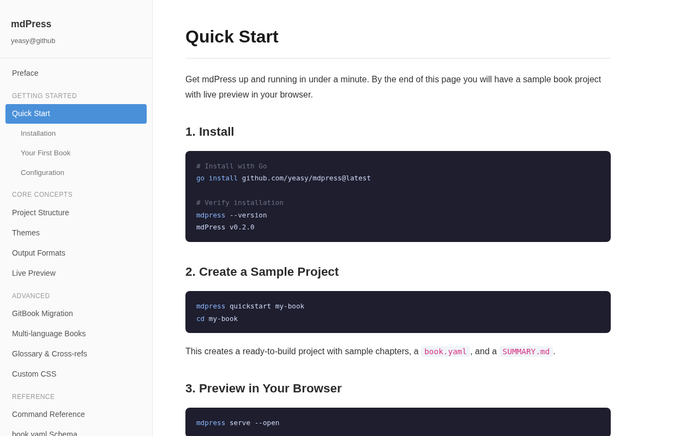
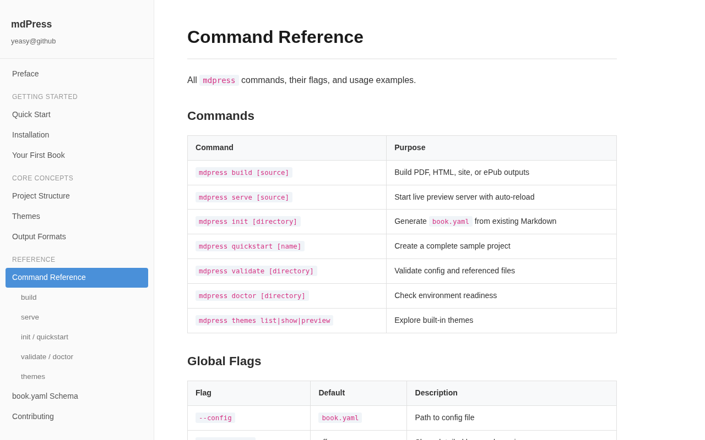
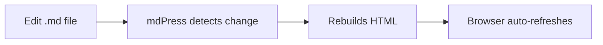
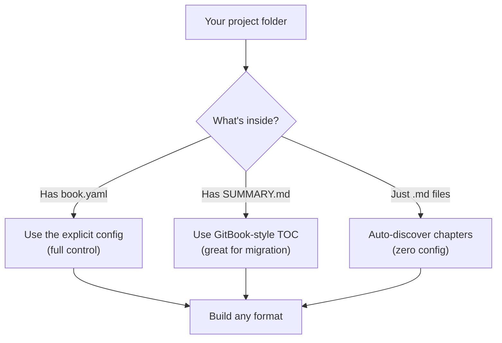

# mdPress

[](https://go.dev/)
[](LICENSE)
[](https://github.com/yeasy/mdpress)

[中文说明](README_zh.md)

**Turn your Markdown into a real book** — PDF, HTML, ePub, or a live-preview website — with one command.

```
$ mdpress build --format pdf,html,site,epub
  ✓ Loaded book.yaml (12 chapters)
  ✓ Parsed Markdown (technical theme)
  ✓ Generated PDF        → _output/my-book.pdf
  ✓ Generated HTML       → _output/my-book.html
  ✓ Generated site       → _output/my-book_site/
  ✓ Generated ePub       → _output/my-book.epub
```

No templates to write. No config files required. Just point `mdpress` at a folder of `.md` files and mdPress figures out the rest.

### What the output looks like

`mdpress serve` generates a documentation site with sidebar navigation, chapter structure, and built-in themes:



`mdpress build --format site` produces a polished multi-page site, ready for hosting:



## Get Started In 60 Seconds

```bash
# 1. Install (Homebrew)
brew tap yeasy/tap
brew install mdpress

# Or install with Go
go install github.com/yeasy/mdpress@latest

# 2. Create a sample book and preview it
mdpress quickstart my-book
cd my-book
mdpress serve
```

Open `http://127.0.0.1:9000` in your browser to see the live-preview site. Edit any `.md` file and the browser refreshes automatically. If you want mdPress to launch the browser for you, run `mdpress serve --open`:



When you are ready to publish:

```bash
mdpress build --format pdf,html
```

That's it. You now have a printable PDF and a self-contained HTML file.

## What You Get

| Format | Command | Result |
| --- | --- | --- |
| PDF | `mdpress build --format pdf` | A printable book with cover, TOC, and page numbers |
| HTML | `mdpress build --format html` | A single self-contained `.html` file you can email or upload |
| Site | `mdpress build --format site` | A multi-page website ready for GitHub Pages or Netlify |
| ePub | `mdpress build --format epub` | An ebook for Kindle, Apple Books, etc. |
| Preview | `mdpress serve` | A local website with live reload |

### HTML vs Site: What's the difference?

- **`html`** produces a single self-contained `.html` file with all chapters on one page. It includes a sidebar for navigation, embedded images, and everything needed to read offline. Great for sharing via email or uploading to a file host.

- **`site`** produces a multi-page static website with one HTML file per chapter, an index page, and sidebar navigation. Designed for deployment to GitHub Pages, Netlify, or any static hosting platform.

Use `html` when you need a single portable file. Use `site` when you want a proper documentation website.

## Three Ways To Use It

mdPress figures out your project structure automatically:



### Already have a docs folder?

```bash
mdpress build ./docs --format html
mdpress serve ./docs
```

### Migrating from GitBook?

If your project has a `SUMMARY.md`, mdPress picks it up automatically:

```bash
mdpress build    # reads SUMMARY.md, just works
mdpress serve    # live preview
```

See the full [GitBook migration guide](docs/MIGRATION_FROM_GITBOOK.md).

### Want full control?

Create a `book.yaml`:

```yaml
book:
  title: "My Book"
  author: "Author Name"

chapters:
  - title: "Preface"
    file: "README.md"
  - title: "Getting Started"
    file: "chapter01/README.md"

style:
  theme: "technical"    # or "elegant", "minimal"

output:
  toc: true
  cover: true
```

Then `mdpress build --format pdf` generates a professional PDF with cover page, table of contents, and syntax highlighting.

### Build from a GitHub repo

```bash
mdpress build https://github.com/yeasy/agentic_ai_guide --format html
mdpress serve https://github.com/yeasy/agentic_ai_guide
```

## Built-In Themes

mdPress ships with three themes. Preview them all with `mdpress themes preview`:

```
$ mdpress themes list
  technical   — Clean and structured, ideal for technical documentation
  elegant     — Refined serif typography for books and essays
  minimal     — Light and distraction-free
```

Set `style.theme` in `book.yaml` to switch themes.

## Why mdPress Over Other Tools?

| Capability | mdPress | mdBook | HonKit | Docusaurus |
| --- | --- | --- | --- | --- |
| PDF output | **Yes** | No | Plugin | No |
| HTML single-page | **Yes** | No | Yes | No |
| Multi-page site | **Yes** | Yes | Yes | Yes |
| ePub output | **Yes** | No | Plugin | No |
| Live preview | **Yes** | Yes | Yes | Yes |
| Zero-config mode | **Yes** | No | No | No |
| GitBook migration | **Yes** | No | Native | No |
| Single binary | **Yes** | Yes | No (Node.js) | No (Node.js) |

## All Commands

| Command | What it does |
| --- | --- |
| `mdpress build [source]` | Build PDF, HTML, site, or ePub |
| `mdpress serve [source]` | Start live preview with auto-reload |
| `mdpress quickstart [name]` | Create a complete sample project |
| `mdpress init [directory]` | Generate `book.yaml` from existing Markdown files |
| `mdpress validate [directory]` | Check your config and files for errors |
| `mdpress doctor [directory]` | Verify your environment is set up correctly |
| `mdpress themes list\|show\|preview` | Explore built-in themes |

## Requirements

- **Go 1.21+** for installation
- **Chrome or Chromium** — only needed for PDF output. HTML, site, and ePub work without it.

| System | Chrome install |
| --- | --- |
| macOS | `brew install chromium` or install Chrome |
| Ubuntu/Debian | `sudo apt install chromium-browser` |
| Windows | Install [Google Chrome](https://www.google.com/chrome/) |

Run `mdpress doctor` to check if everything is ready.

## Learn More

| Document | Description |
| --- | --- |
| [Command manuals](docs/COMMANDS.md) | Every flag and option explained |
| [GitBook migration](docs/MIGRATION_FROM_GITBOOK.md) | Step-by-step migration guide |
| [Architecture](docs/ARCHITECTURE.md) | How mdPress works internally |
| [Roadmap](docs/ROADMAP.md) | What's coming next |
| [Changelog](CHANGELOG.md) | Release history |

## Build From Source

```bash
git clone https://github.com/yeasy/mdpress.git
cd mdpress
make build        # binary at bin/mdpress
make test         # run all tests
```

## Contributing

See [CONTRIBUTING.md](CONTRIBUTING.md).

## License

[MIT License](LICENSE)
