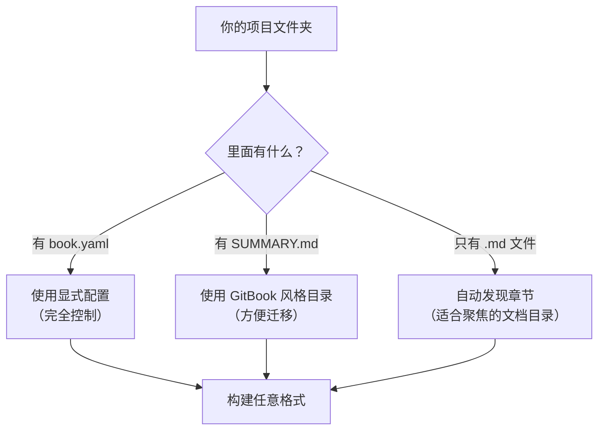

# mdPress

<p align="center">
  
</p>

[](https://go.dev/)
[](LICENSE)
[](https://github.com/yeasy/mdpress)

[English](README.md)

**把 Markdown 发布成精致文档站、可打印 PDF、便携 HTML 和 ePub**。

```
$ mdpress build --format site,pdf,html,epub
  ✓ Loaded book.yaml (12 chapters)
  ✓ Parsed Markdown (technical theme)
  ✓ Generated Markdown mirrors  → _output/my-book_site/*.md
  ✓ Generated PDF        → _output/my-book.pdf
  ✓ Generated HTML       → _output/my-book.html
  ✓ Generated site       → _output/my-book_site/
  ✓ Generated ePub       → _output/my-book.epub
```

需要完全控制时用 `book.yaml`，迁移 GitBook 风格项目时用 `SUMMARY.md`，想快速开始时可对一个聚焦的文档目录启用零配置发现。对于大型仓库，请把 mdPress 指向具体文档目录，而不是仓库根目录。

## 为什么会选 mdPress

- **一份 Markdown，多种产物**：同一套内容可同时生成站点、HTML、PDF 和 ePub。
- **写作反馈快**：`mdpress serve` 提供实时预览、搜索、侧边栏导航和深色模式。
- **兼容现有项目**：支持 `book.yaml`、`SUMMARY.md` 和整洁目录下的 Markdown 自动发现。
- **适合发布流程**：可迁移 GitBook/HonKit，可导出审阅文件，也能把生成站点部署到任意静态托管。

## 适合的场景

- 既要在线文档站，也要打印版 PDF 的技术文档
- 使用 Git 维护的内部手册和团队规范
- 需要同时发布 HTML、PDF、ePub 的指南或书籍

## 场景展示

### 技术文档

- 主题：`technical`
- 推荐输出：`site` + `pdf`
- 适合产品文档、API 指南、运维手册

### 团队手册

- 主题：`minimal`
- 推荐输出：`site` + `html`
- 适合入职手册、内部标准、流程文档

### 书籍或长文

- 主题：`elegant`
- 推荐输出：`pdf` + `epub`
- 适合长篇写作、文集、叙述型文档

### 渲染效果预览

`mdpress serve` 生成带侧边栏导航、章节结构和内置主题的文档站点：


`mdpress build --format site` 生成精美的多页站点，可直接部署：


生成站点默认包含：

- `Cmd/Ctrl+K` 全文搜索
- 侧边栏导航和本页目录
- 深色模式
- 每个页面对应的 Markdown 镜像
- 方便 LLM 读取的 `llms.txt` 与 `llms-full.txt`

## 安装

### Homebrew（macOS / Linux）

```bash
brew tap yeasy/tap
brew install mdpress
```

### Go Install

```bash
go install github.com/yeasy/mdpress@latest
```

### Docker

```bash
# 精简镜像（~15 MB，不含 PDF 支持）
docker run --rm -v "$(pwd):/book" ghcr.io/yeasy/mdpress build

# 完整镜像（~300 MB，含 Chromium 用于 PDF 生成）
docker run --rm -v "$(pwd):/book" ghcr.io/yeasy/mdpress:full build --format pdf
```

### 直接下载 Binary

从 [GitHub Releases](https://github.com/yeasy/mdpress/releases) 下载对应平台的预编译 binary。

支持平台：macOS (amd64 / arm64)、Linux (amd64 / arm64)、Windows (amd64 / arm64)。

## 60 秒上手

```bash
# 1. 安装 mdpress（见上方安装章节）

# 2. 创建示例书并预览
mdpress quickstart my-book
cd my-book
mdpress serve
```

在浏览器中打开 `http://127.0.0.1:9000` 即可看到实时预览站点。编辑任何 `.md` 文件，浏览器自动刷新。如果希望 mdPress 自动拉起浏览器，请使用 `mdpress serve --open`：


准备好发布时：

```bash
mdpress build --format pdf,html
```

就这样。你现在有了一个可打印的 PDF 和一个自包含的 HTML 文件。

## 已有项目

已经有 Markdown 书籍项目了？直接把 mdPress 指向它：

```bash
# 实时预览已有项目
mdpress serve ~/my-book/

# 构建 HTML 输出
mdpress build --format html ~/my-book/

# 从 GitHub 仓库构建
mdpress build https://github.com/user/repo

# 从 GitBook/HonKit 迁移
mdpress migrate ~/my-gitbook-project/
```

mdPress 自动识别 `book.yaml`、`book.json` 或 `SUMMARY.md`。零配置发现最适合一个目录只对应一套文档或一本书的场景。

## 能生成什么

| 格式 | 命令 | 结果 |
| --- | --- | --- |
| PDF | `mdpress build --format pdf` | 带封面、目录、页码、页边距和可选水印的可打印书籍 |
| HTML | `mdpress build --format html` | 单个自包含 `.html` 文件，可邮件发送或上传 |
| 站点 | `mdpress build --format site` | 多页网站，可部署到 GitHub Pages 或 Netlify |
| ePub | `mdpress build --format epub` | 电子书，支持 Kindle、Apple Books 等 |
| Typst | `mdpress build --format typst` | 实验性 PDF 后端；在已安装 Typst CLI 时可作为 Chromium-free 替代方案 |
| 预览 | `mdpress serve` | 本地实时预览网站 |

### HTML 和 Site 有什么区别？

- **`html`** 生成一个自包含的单个 `.html` 文件，所有章节在同一页面上，包含侧边栏导航和嵌入图片，适合离线阅读。适用于通过邮件分享或上传到文件托管平台。

- **`site`** 生成一个多页静态网站，每个章节一个 HTML 文件，带有首页和侧边栏导航。适合部署到 GitHub Pages、Netlify 或其他静态托管平台。

需要单个便携文件时用 `html`，需要正式文档网站时用 `site`。

## 三种使用方式

mdPress 自动识别你的项目结构：



### 已有文档目录？

```bash
mdpress build ./docs --format html
mdpress serve ./docs
```

### 从 GitBook 迁移？

如果你的项目有 `SUMMARY.md`，mdPress 会自动识别：

```bash
mdpress build    # 读取 SUMMARY.md，直接可用
mdpress serve    # 实时预览
```

完整指南见 [GitBook 迁移手册](docs/MIGRATION_FROM_GITBOOK_zh.md)。

### 想要完全控制？

创建 `book.yaml`：

```yaml
book:
  title: "我的书"
  author: "作者名"

chapters:
  - title: "前言"
    file: "README.md"
  - title: "快速开始"
    file: "chapter01/README.md"

style:
  theme: "technical"    # 或 "elegant"、"minimal"

output:
  toc: true
  cover: true
```

然后 `mdpress build --format pdf` 就能生成一本有封面、目录和语法高亮的专业 PDF。

### 直接构建 GitHub 仓库

```bash
mdpress build https://github.com/yeasy/agentic_ai_guide --format html
mdpress serve https://github.com/yeasy/agentic_ai_guide
```

## 内置主题

mdPress 自带三款主题。用 `mdpress themes preview` 预览全部：

```
$ mdpress themes list
  technical   — 清晰有结构，适合技术文档
  elegant     — 优雅衬线字体，适合图书和文集
  minimal     — 轻量简洁，减少干扰
```

通过 `book.yaml` 中的 `style.theme` 切换主题。

## 所有命令

| 命令 | 作用 |
| --- | --- |
| `mdpress build [source]` | 构建 PDF、HTML、站点或 ePub |
| `mdpress serve [source]` | 启动实时预览（自动刷新） |
| `mdpress quickstart [name]` | 创建完整示例项目 |
| `mdpress migrate [directory]` | 从 GitBook/HonKit 迁移到 mdPress |
| `mdpress init [directory]` | 从已有 Markdown 生成 `book.yaml` |
| `mdpress validate [directory]` | 检查配置和文件是否有错误 |
| `mdpress doctor [directory]` | 检查环境是否配置正确 |
| `mdpress upgrade` | 检查并安装 mdpress 的新版本 |
| `mdpress completion [shell]` | 生成 Shell 补全脚本 |
| `mdpress themes list\|show\|preview` | 浏览内置主题 |

## 环境要求

- **Go 1.25+** 用于安装
- **Chrome 或 Chromium** — 仅 PDF 默认后端需要。HTML、站点和 ePub 不依赖它。
- **Typst CLI**（可选） — 安装 Typst 后，可启用 `--format typst`，作为 Chromium-free 的 PDF 替代方案。

### Chrome/Chromium 安装

| 系统 | Chrome 安装方式 |
| --- | --- |
| macOS | `brew install chromium` 或安装 Chrome |
| Ubuntu/Debian | `sudo apt install chromium-browser` |
| Windows | 安装 [Google Chrome](https://www.google.com/chrome/) |

### Typst 安装（可选）

使用 Typst 后端替代方案，请从 [typst.app](https://typst.app) 安装 Typst。

运行 `mdpress doctor` 检查环境是否就绪。

## 深入了解

| 文档 | 说明 |
| --- | --- |
| [用户手册](docs/manual/zh/) | mdPress 完整使用指南 |
| [命令手册](docs/COMMANDS_zh.md) | 每个参数和选项的详细说明 |
| [GitBook 迁移](docs/MIGRATION_FROM_GITBOOK_zh.md) | 逐步迁移指南 |
| [架构设计](docs/ARCHITECTURE_zh.md) | mdPress 内部如何工作 |
| [路线图](docs/ROADMAP_zh.md) | 未来计划 |
| [变更日志](CHANGELOG.md) | 版本历史 |

## 从源码构建

```bash
git clone https://github.com/yeasy/mdpress.git
cd mdpress
make build        # 二进制文件在 bin/mdpress
make test         # 运行所有测试
```

## 贡献

参见 [CONTRIBUTING_zh.md](CONTRIBUTING_zh.md)。

## 许可证

[MIT License](LICENSE)
