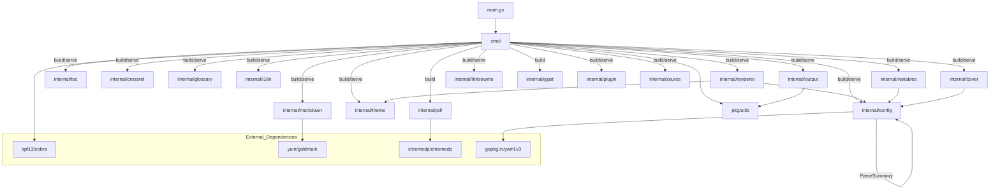
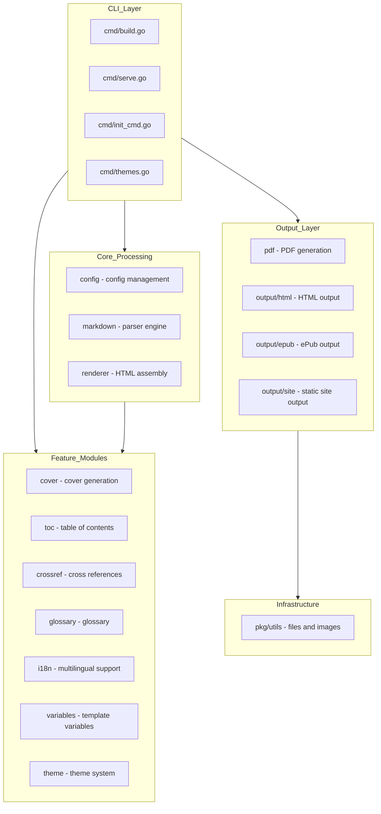
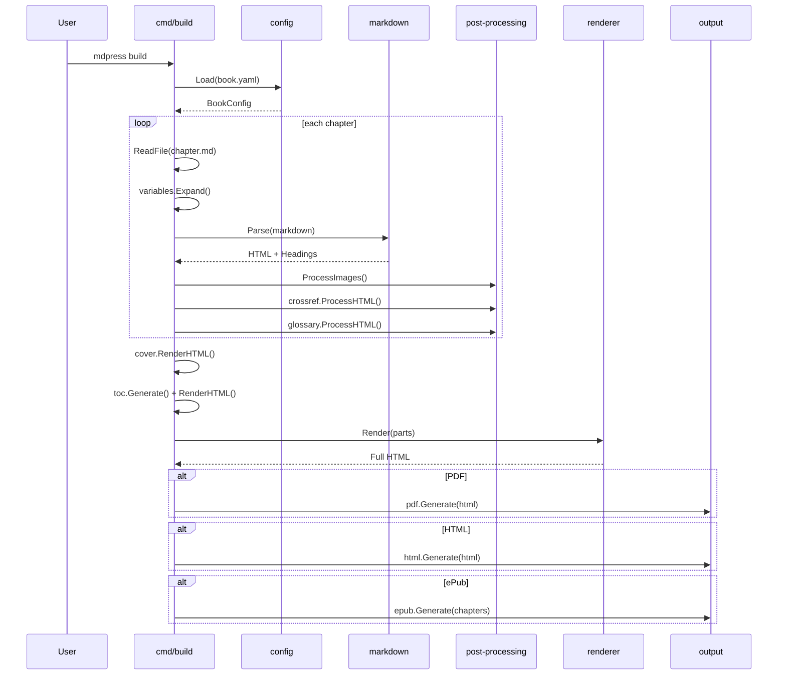
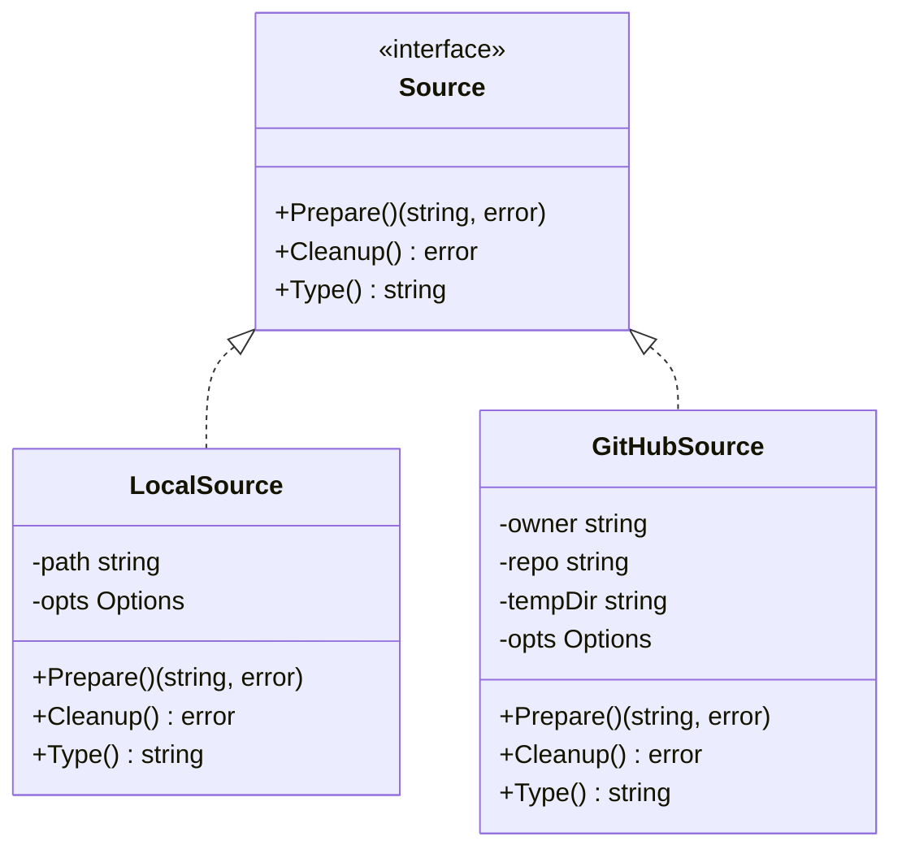
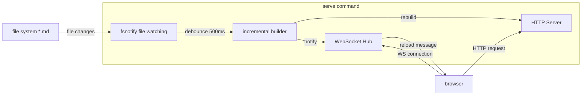
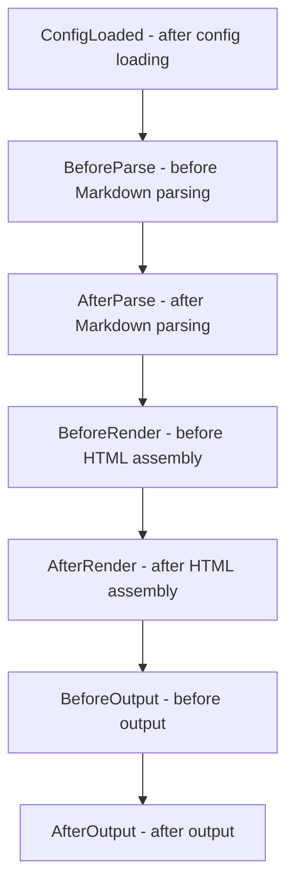

# mdPress Architecture

[中文说明](ARCHITECTURE_zh.md)

> Version: v0.7.9
> Updated: 2026-04-19

## 1. System Overview

mdPress is a CLI that turns Markdown books or long-form documentation into PDF, HTML, site, and ePub outputs. The overall architecture follows a pipeline model: content moves from source loading through parsing and post-processing into final output generation.

### 1.1 Core Pipeline

```
Source
  │
  ▼
Config Loading
  │  book.yaml / SUMMARY.md / auto-discovery
  ▼
Preprocessing
  │  variable expansion, language detection
  ▼
Markdown Parsing
  │  Goldmark AST -> HTML
  │  code highlighting, GFM extensions, footnotes
  ▼
Post-Processing
  │  image embedding / path resolution
  │  cross-reference resolution
  │  glossary highlighting
  │  GFM Alert / Mermaid conversion
  │  PlantUML local/server rendering
  ▼
Assembly
  │  cover + TOC + chapters -> full HTML
  │  theme CSS + custom CSS + print CSS
  ▼
Output
  ├─ PDF: Chromium headless -> printToPDF
  ├─ PDF (Typst): Typst CLI -> native PDF
  ├─ HTML: single-page document or multi-page site
  ├─ Site: multi-page static website
  └─ ePub 3: ZIP(OPF + NCX + XHTML + Navigation Document)
```

### 1.2 Command Structure

```
mdpress (root)
  ├─ build       Build PDF/HTML/ePub/site outputs
  ├─ serve       Start the local preview server
  ├─ init        Initialize a project skeleton
  ├─ quickstart  Create a sample project and preview it
  ├─ validate    Validate project configuration
  ├─ doctor      Verify environment setup
  ├─ migrate     Migrate from GitBook/HonKit
  ├─ upgrade     Self-upgrade to the latest release
  ├─ completion  Generate shell completion scripts
  ├─ version     Print version information
  └─ themes      Inspect themes (list / show / preview)
```

## 2. Module Dependency Map



### 2.1 Layered Architecture



## 3. Module Responsibilities And Interfaces

### 3.1 `cmd/` - CLI Command Layer

| File | Responsibility |
| --- | --- |
| `root.go` | Cobra root command and global flags such as `--config` and `--verbose` |
| `build.go` | Build command: source resolution, config loading, format dispatch |
| `build_run.go` | Core build execution: rendering pipeline, output generation |
| `build_orchestrator.go` | `buildOrchestrator` for concurrent chapter processing |
| `build_manifest.go` | Build manifest for incremental/cached builds |
| `chapter_pipeline.go` | Parallel chapter parsing and post-processing pipeline |
| `chapter_cache.go` | Chapter-level build caching |
| `format_builders.go` | `formatBuilderRegistry` for output format dispatch |
| `serve.go` | Build the preview site and start the HTTP server |
| `init_cmd.go` | Scan a directory and generate a `book.yaml` skeleton |
| `quickstart.go` | Create a sample project and make it previewable immediately |
| `validate.go` | Validate `book.yaml` and related project structure |
| `validate_mermaid.go` | Server-side Mermaid diagram validation via Chromium |
| `themes.go` | List and show built-in themes |
| `themes_preview.go` | Generate visual theme preview images |
| `doctor.go` | Verify environment setup (Chromium, fonts, etc.) |
| `migrate.go` | Migrate from GitBook/HonKit configuration |
| `upgrade.go` | Self-upgrade to the latest release from GitHub |
| `navigation.go` | Navigation helpers for site output (prev/next) |
| `issues.go` | Project issue collection and reporting |
| `completion.go` | Shell completion script generation |
| `version.go` | Print version and build information |

Key functions:

- `executeBuild()` dispatches to `executeBuildForConfig()` per language
- `executeBuildForConfig()` runs the full render-and-output pipeline
- `buildOrchestrator.ProcessChapters()` for concurrent chapter parsing
- `executeServe()` as build-plus-server orchestration

### 3.2 `internal/config` - Config Management

Responsibility: load `book.yaml`, parse `SUMMARY.md`, and auto-detect `GLOSSARY.md` and `LANGS.md`.

Core types:

```go
type BookConfig struct {
    Book     BookMeta
    Chapters []ChapterDef
    Style    StyleConfig
    Output   OutputConfig
    Plugins  []PluginConfig
}

type ChapterDef struct {
    Title    string
    File     string
    Sections []ChapterDef
}
```

Key methods:

- `Load(path) -> (*BookConfig, error)` to load config and discover companion files
- `Validate() -> error` to check config completeness
- `ResolvePath(p) -> string` to resolve relative paths against the config directory
- `ParseSummary(path) -> ([]ChapterDef, error)` to parse GitBook-style `SUMMARY.md`

### 3.3 `internal/markdown` - Markdown Parsing Engine

Responsibility: convert Markdown to HTML using Goldmark with support for GFM, footnotes, syntax highlighting, and heading ID generation.

Core types:

```go
type Parser struct { ... }
type ParserOption func(*Parser)
type HeadingInfo struct {
    Level  int
    Text   string
    ID     string
    Line   int
    Column int
}
```

Key methods:

- `NewParser(opts...) -> *Parser`
- `Parse(content) -> (html, []HeadingInfo, error)`
- `postProcess(html) -> string` (package-level, unexported) for alert and Mermaid transformations

### 3.4 `internal/renderer` - HTML Assembler

Responsibility: combine cover, TOC, chapter HTML, and CSS into one complete HTML5 document.

Core types:

```go
type HTMLRenderer struct { ... }
type RenderParts struct {
    CoverHTML    string
    TOCHTML      string
    ChaptersHTML []ChapterHTML
    CustomCSS    string
}
```

Key method:

- `Render(parts) -> (string, error)`

### 3.5 `internal/pdf` - PDF Generator

Responsibility: convert HTML into PDF through a headless Chromium session.

Core types:

```go
type Generator struct { ... }
type GeneratorOption func(*Generator)
```

Key methods:

- `Generate(html, outputPath) -> error`
- `GenerateFromFile(htmlPath, outputPath) -> error`

### 3.6 `internal/output` - Output Generation

Responsibility: produce HTML documents, static sites, and ePub outputs.

| Component | Responsibility |
| --- | --- |
| `HTMLGenerator` | Single-page HTML output |
| `SiteGenerator` | GitBook-style multi-page static site |
| `EpubGenerator` | ePub output |

### 3.7 `internal/cover` - Cover Generation

Responsibility: generate a cover page from book metadata, with either a cover image or a solid-color background.

### 3.8 `internal/toc` - Table Of Contents

Responsibility: build a hierarchical TOC tree from flattened heading lists and render it as nested HTML.

Algorithm: use a stack to build parent-child relationships from heading levels.

### 3.9 `internal/crossref` - Cross References

Responsibility: register figures, tables, and sections; replace `{{ref:id}}` placeholders; add figure and table captions automatically.

Numbering rules:

- Figures and tables increment in appearance order
- Sections use hierarchical numbering such as `1.2.3`

### 3.10 `internal/glossary` - Glossary

Responsibility: parse `GLOSSARY.md`, highlight glossary terms in HTML, attach tooltips, and render a glossary page.

### 3.11 `internal/variables` - Variable Expansion

Responsibility: expand template variables such as `{{ book.title }}` before Markdown parsing.

### 3.12 `internal/theme` - Theme System

Responsibility: manage built-in and custom themes and produce CSS.

Built-in themes:

- `technical`
- `elegant`
- `minimal`

### 3.13 `internal/i18n` - Multilingual Support

Responsibility: parse `LANGS.md` and detect multilingual projects.

### 3.14 `internal/linkrewrite` - Link Rewriting

Responsibility: rewrite Markdown `.md` links in HTML content to appropriate targets based on the output format.

Core types:

```go
type Mode string   // ModeSingle or ModeSite
type Target struct {
    ChapterID    string
    PageFilename string
}
```

Key functions:

- `RewriteLinks(html, currentFile, targets, mode) -> string` — rewrite all `.md` href attributes
- `NormalizePath(path) -> string` — normalize chapter file paths for consistent lookups

In single-page mode (`ModeSingle`), `.md` links become `#chapter-id` anchors. In site mode (`ModeSite`), they become page filenames like `ch_001.html`. Unresolved links are annotated with `data-mdpress-link="unresolved-markdown"`.

### 3.15 `pkg/utils` - Utility Helpers

Responsibility: file I/O, image downloading and base64 embedding, path resolution, and HTML escaping.

### 3.16 `internal/typst` - Typst PDF Generator

Responsibility: generate PDF files using the Typst command-line tool as an alternative to Chromium.

Typst is a markup-based PDF engine. The `Generator` type:

- Accepts Markdown or raw Typst content
- Converts Markdown to Typst syntax using `MarkdownToTypstConverter`
- Renders a Typst template with document metadata, page size, margins, and fonts
- Invokes `typst compile` to produce the final PDF

Configuration options:

```go
type Generator struct {
    timeout, pageSize, margins, fontFamily, fontSize, lineHeight, language, author, title, version, date
}
```

Advantages over Chromium: faster compilation, native PDF output, no browser dependency.

### 3.17 `internal/plantuml` - PlantUML Diagram Renderer

Responsibility: detect and render PlantUML code blocks in HTML to SVG.

The `Renderer` type:

- Searches HTML for `language-plantuml` code blocks
- Encodes PlantUML syntax using deflate + base64 custom alphabet
- Fetches SVG from the PlantUML online server or renders locally via `plantuml` CLI / `PLANTUML_JAR`
- Caches rendered SVGs to avoid repeated network calls
- Wraps each SVG in a div for styling

Key method: `RenderHTML(ctx, html) -> (string, error)` replaces all PlantUML blocks with SVG output. Local rendering detects `plantuml` on PATH or uses `PLANTUML_JAR` env var.

### 3.18 `internal/server` - Development Server

Responsibility: provide file watching and live browser reloads for `mdpress serve`.

The `Server` type:

- Listens on a specified host and port
- Watches `.md`, `.yaml`, `.yml`, and `.css` files using `fsnotify`
- Injects live-reload JavaScript into HTML responses
- Maintains a WebSocket hub for push notifications to connected clients
- Debounces file changes (500ms) to avoid repeated rebuilds
- Supports CSS-only updates (reload stylesheets) vs. full page reloads
- Falls back to polling if `fsnotify` is unavailable

Reloads are triggered via WebSocket messages; the browser-side script listens for `{"type":"reload"}` and full-page navigation.

## 4. Data Flow

### 4.1 Build Command Flow



### 4.2 Chapter Processing Flow

```
chapter.md (raw Markdown)
  │
  ├─ variables.Expand()        -> replace {{book.title}} and similar variables
  │
  ├─ parser.Parse()            -> HTML + HeadingInfo[]
  │
  ├─ utils.ProcessImages()     -> resolve image paths / embed base64
  │
  ├─ crossref.RegisterSection()
  ├─ crossref.ProcessHTML()    -> replace {{ref:id}} with numbered links
  ├─ crossref.AddCaptions()    -> add figcaption / caption
  │
  └─ glossary.ProcessHTML()    -> term highlighting + tooltip
      │
      ▼
  ChapterHTML { Title, ID, Content }
```

### 4.3 Parallel Chapter Processing

Chapter parsing (`chapterPipeline`) uses worker pools to process chapters concurrently:

- `computeMaxConcurrency()` determines worker count: uses `runtime.NumCPU()` (capped at 8) by default, or respects explicit `MaxConcurrency` config.
- `parseChaptersParallel()` distributes chapters to workers via job and result channels.
- Each worker runs its own `markdown.Parser` instance (goldmark state is not thread-safe).
- Results are collected in order, maintaining chapter sequence for TOC and assembly.
- First error halts all workers; panics are recovered and returned as errors.

### 4.4 Incremental Builds

Build manifest (`cmd/build_manifest.go`) enables fast incremental rebuilds via SHA-256 hashing:

- `loadManifest()` reads cached chapter state from `build-manifest.json`.
- `computeChapterHash()` calculates SHA-256 of chapter file content.
- `buildManifest.IsStale()` checks if app version, config, or CSS changed (invalidates entire cache if true).
- `buildManifest.GetEntry()` looks up cached HTML and headings for unchanged chapters.
- Chapters with matching hash skip parsing and reuse cached output.

Cache is stored in the project cache directory and survives across builds unless `MDPRESS_CACHE_DIR` is disabled.

## 5. Implemented And Planned Architecture Extensions

> Sections 5.1 through 5.4 describe architecture that has been **implemented**. Section 5.5 describes plugin extension points that are now available.

### 5.1 Source Abstraction (Implemented)

The `Source` interface abstracts "where content comes from" so mdPress can read from local filesystems, GitHub repositories, and future providers.

Interface:

```go
// Source defines a unified abstraction for content sources.
// Prepare returns a local directory path containing the content.
type Source interface {
    Prepare() (string, error)
    Cleanup() error
    Type() string
}
```

Class diagram:



Current implementations:

- `LocalSource` (implemented)
- `GitHubSource` (implemented, supports `GITHUB_TOKEN` for private repos)
- `GitLabSource` (future extension)
- `URLSource` (future extension)

Integration:

- `source.Detect()` selects a `Source` implementation based on the input URL or path
- `cmd/build.go` and `cmd/serve.go` use `Source` for project retrieval
- `LocalSource` wraps filesystem behavior so existing flows remain compatible

### 5.2 Config Discovery Chain (Implemented)

Priority:

```
1. book.yaml with explicit chapters              ← Highest priority
   │ (if chapters is empty)
   ▼
2. book.json (GitBook compatibility)             ← Converted to book.yaml format
   │ (if book.json does not exist)
   ▼
3. SUMMARY.md in the same directory              ← GitBook compatible
   │ (if SUMMARY.md does not exist)
   ▼
4. Automatic scanning of *.md files              ← Zero-config experience
   by directory structure + filename order
   uses README.md as first chapter if present
   excludes: SUMMARY.md, GLOSSARY.md, LANGS.md
```

Design:

The `Discover()` function in `internal/config/discover.go` implements a priority-based
discovery chain with inline logic:

```go
func Discover(ctx context.Context, dir string) (*BookConfig, error)
```

Discovery priority:

1. `book.yaml` / `book.json` — loads explicit configuration
2. `SUMMARY.md` — parses GitBook-compatible summary
3. Auto-discover — scans Markdown files by directory structure

### 5.3 Output Format Abstraction (Implemented)

All output formats are normalized behind the `formatBuilder` interface (in `cmd/format_builders.go`) with a `formatBuilderRegistry` for registration and dispatch. The build pipeline uses the registry instead of switch-case logic.

Interface:

```go
type formatBuilder interface {
    Name() string
    Build(ctx *buildContext, baseName string) error
}
```

Mappings:

| Implementation | Existing Code |
| --- | --- |
| `pdfBuilder` | `internal/pdf.Generator` |
| `htmlBuilder` | `internal/output.HTMLGenerator` |
| `siteBuilder` | `internal/output.SiteGenerator` |
| `epubBuilder` | `internal/output.EpubGenerator` |
| `typstBuilder` | `internal/typst.Generator` |

The `formatBuilderRegistry` is created at startup with all built-in builders pre-registered:

```go
type formatBuilderRegistry struct {
    builders map[string]formatBuilder
}
```

### 5.4 Server Module (Implemented)

The development server provides file watching and browser reload for `serve`.

Architecture diagram:



Key components:

```go
// Server is the development server with live reload.
type Server struct {
    Host      string
    Port      int
    WatchDir  string
    OutputDir string
    AutoOpen  bool
    BuildFunc func() error

    clients   map[*wsClient]struct{}
    clientsMu sync.RWMutex
    logger    *slog.Logger
    upgrader  websocket.Upgrader

    // Debounce state for file-change rebuilds.
    debounceTimer *time.Timer
    debounceMu    sync.Mutex
}

// wsClient wraps a single WebSocket connection with a dedicated write lock.
type wsClient struct {
    conn    *websocket.Conn
    writeMu sync.Mutex
}
```

The server performs:

1. Reuses the existing site build for the initial render
2. Watches `.md`, `.yaml`, `.yml`, and `.css` files with `fsnotify`
3. Injects WebSocket client code into generated HTML via middleware
4. Debounces file change events and triggers rebuilds
5. Broadcasts reload messages to connected WebSocket clients

### 5.5 Plugin Extension Points

Goal: provide plugin lifecycle hooks so external plugins can tap into the build pipeline.

Lifecycle hooks:



Capability matrix:

| Hook | Typical Use | Example Plugins |
| --- | --- | --- |
| `ConfigLoaded` | Inject defaults or environment-derived config | Environment variable injection |
| `BeforeParse` | Preprocess Markdown, include directives, custom syntax | Custom syntax plugins, include directives |
| `AfterParse` | Transform generated HTML | Automatic link checking |
| `BeforeRender` | Modify `RenderParts` | Custom cover plugins |
| `AfterRender` | Inject SEO tags or watermarks | SEO plugins, watermark plugins |
| `BeforeOutput` | Intercept output destination or output metadata | Output path customization |
| `AfterOutput` | Upload artifacts or send notifications | CDN upload, notification plugins |

## 6. Refactoring Notes

### 6.1 Refactors Already Completed

#### 6.1.1 New Interface Files

- `internal/source/source.go` for `Source` and `LocalSource`
- `internal/output/output.go` for `OutputFormat`, `Registry`, and `RenderRequest`
- `internal/plugin/plugin.go` for plugin interfaces and hook placeholders

#### 6.1.2 Interface Design Principles

1. Backward compatibility: new interfaces wrap existing behavior
2. Incremental migration: `cmd/build.go` can move gradually
3. Minimal interfaces: each interface exposes only required methods
4. Context propagation: long-running work should accept `context.Context`

### 6.2 Refactors Completed In v0.2.0

The following refactors from the original plan have been completed:

#### 6.2.1 Build Pipeline Split (Completed)

`buildOrchestrator` (`cmd/build_orchestrator.go`) and `chapterPipeline` (`cmd/chapter_pipeline.go`) now encapsulate the shared build workflow. Both `build` and `serve` delegate to these types:

```go
type buildOrchestrator struct {
    Config        *config.BookConfig
    Theme         *theme.Theme
    Parser        *markdown.Parser
    Gloss         *glossary.Glossary
    Logger        *slog.Logger
    PluginManager *plugin.Manager
}

func (o *buildOrchestrator) ProcessChapters(ctxOpts ...context.Context) (*chapterPipelineResult, error)
func (o *buildOrchestrator) LoadCustomCSS() string
```

#### 6.2.2 Duplicate Logic Removal (Completed)

`chapterPipeline` eliminated approximately 135 lines of duplicate chapter processing code between `build` and `serve`.

#### 6.2.3 Hard-Coded Values Extraction (Completed)

| Original Location | Change |
| --- | --- |
| PDF timeout | Moved to `OutputConfig.PDFTimeout` (default 120s) |
| Chrome path | Supports `MDPRESS_CHROME_PATH` environment variable |
| Mermaid CDN URL | Centralized in `pkg/utils/constants.go` as `MermaidCDNURL` |

#### 6.2.4 Error Handling (Completed)

- `renderer.NewHTMLRenderer()` and `NewStandaloneHTMLRenderer()` now return `(*Type, error)` instead of calling `panic`
- `pkg/utils/escape.go` provides centralized `EscapeHTML()`, `EscapeXML()`, and `EscapeAttr()`

#### 6.2.5 Testability (Completed)

- `serveOptions` struct replaces global variables for serve configuration
- `internal/pdf/mock.go` provides `mockGenerator` for testing without Chromium
- `server.go` uses an independent `http.ServeMux`

### 6.3 Remaining Refactoring Opportunities

- `source/github.go`: add `GitLabSource` for broader Git hosting support
