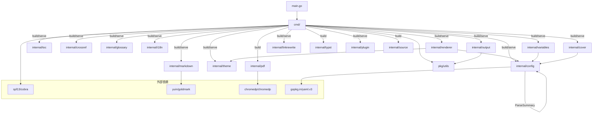
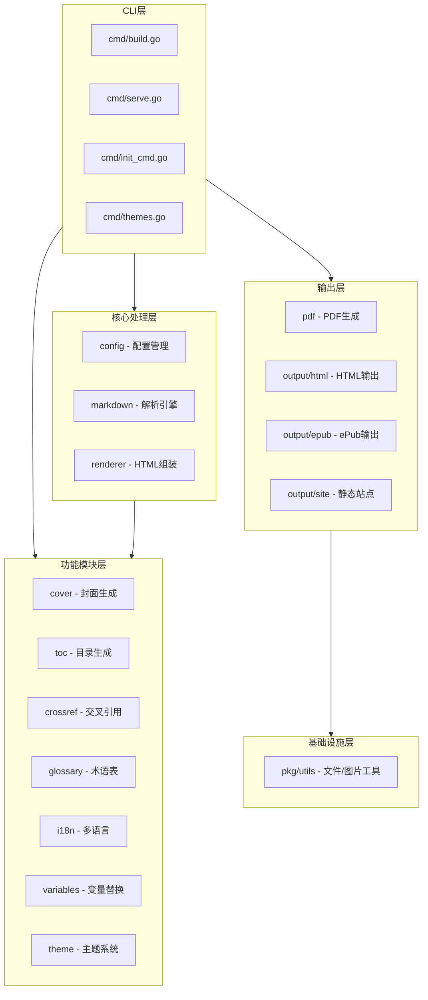
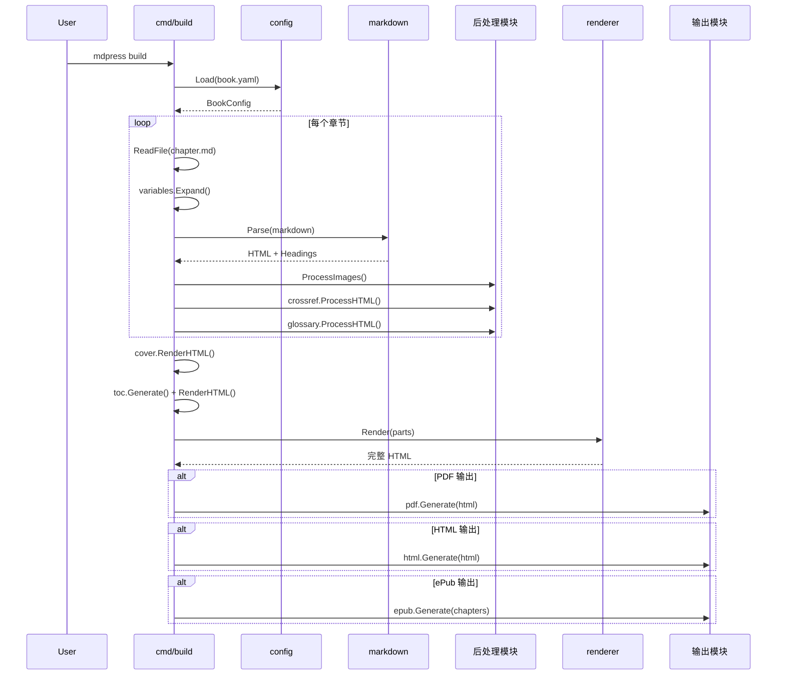
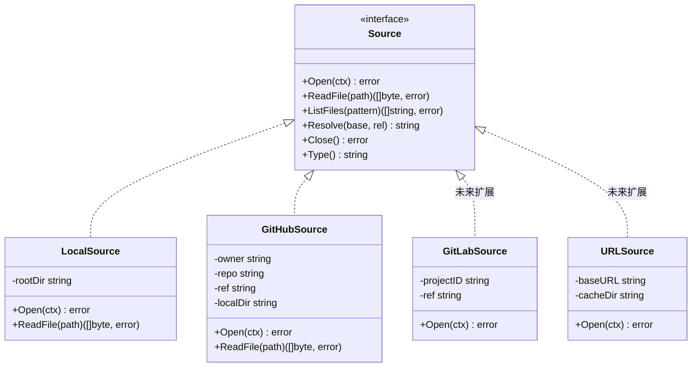
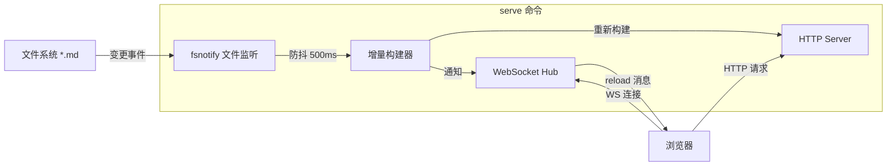
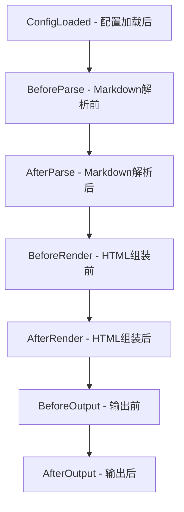

# mdPress 架构设计文档

[English](ARCHITECTURE.md)

> 版本: v0.6.0
> 更新日期: 2026-03-23

## 1. 系统架构总览

mdPress 是一个将 Markdown 格式图书转换为 PDF/HTML/ePub 的命令行工具。整体架构遵循**管道（Pipeline）模式**，数据从输入源经过多个处理阶段，最终输出为目标格式。

### 1.1 核心 Pipeline

```
输入源 (Source)
  │
  ▼
配置加载 (Config)
  │  book.yaml / SUMMARY.md / 自动发现
  ▼
预处理 (Preprocessing)
  │  变量展开、多语言检测
  ▼
Markdown 解析 (Parser)
  │  Goldmark AST → HTML
  │  代码高亮、GFM 扩展、脚注
  ▼
后处理 (PostProcessing)
  │  图片处理（base64 嵌入/路径解析）
  │  交叉引用解析（{{ref:id}} → 编号）
  │  术语表高亮（tooltip 注释）
  │  GFM Alert / Mermaid / PlantUML 转换
  ▼
组装 (Assembly)
  │  封面 + 目录 + 章节 → 完整 HTML
  │  主题 CSS + 自定义 CSS + 打印 CSS
  ▼
输出 (Output)
  ├─ PDF (Chromium):  Chromium headless → printToPDF
  ├─ PDF (Typst): Typst 命令行 → 原生 PDF
  ├─ HTML: 单页 HTML 文档
  ├─ Site: 多页静态站点
  └─ ePub: ZIP(OPF + NCX + XHTML)
```

### 1.2 命令结构

```
mdpress (root)
  ├─ build       构建 PDF/HTML/ePub/Site 输出
  ├─ serve       启动本地预览服务器
  ├─ init        初始化项目骨架
  ├─ quickstart  创建示例项目并立即构建
  ├─ validate    验证项目配置
  ├─ doctor      验证环境设置
  ├─ migrate     从 GitBook/HonKit 迁移
  └─ themes      查看主题（list / show / preview）
```

## 2. 模块依赖关系图



### 2.1 分层架构



## 3. 各模块职责和接口定义

### 3.1 cmd/ — CLI 命令层

| 文件 | 职责 |
|------|------|
| `root.go` | Cobra 根命令，全局 flag（`--config`, `--verbose`） |
| `build.go` | 构建 pipeline 编排：加载配置 → 解析 → 渲染 → 输出 |
| `serve.go` | 构建 HTML 站点并启动 HTTP 服务器 |
| `init_cmd.go` | 扫描目录，生成 book.yaml 骨架 |
| `quickstart.go` | 创建示例项目并立即构建预览 |
| `validate.go` | 验证 book.yaml 配置正确性 |
| `themes.go` | 列出/展示内置主题 |

**关键函数：**
- `executeBuild()` — 核心构建流程编排器
- `executeServe()` — 构建站点 + 启动 HTTP server
- `flattenChapters()` — 递归展平嵌套章节定义

### 3.2 internal/config — 配置管理

**职责：** 加载 book.yaml，解析 SUMMARY.md，自动检测 GLOSSARY.md / LANGS.md。

**核心类型：**
```go
type BookConfig struct {     // 顶层配置
    Book     BookMeta         // 书籍元数据
    Chapters []ChapterDef     // 章节定义（支持嵌套）
    Style    StyleConfig      // 样式配置
    Output   OutputConfig     // 输出配置
}

type ChapterDef struct {     // 章节定义
    Title    string
    File     string
    Sections []ChapterDef     // 嵌套子章节
}
```

**关键方法：**
- `Load(path) → (*BookConfig, error)` — 加载配置，自动发现辅助文件
- `Validate() → error` — 校验配置完整性
- `ResolvePath(p) → string` — 基于配置目录解析相对路径
- `ParseSummary(path) → ([]ChapterDef, error)` — 解析 SUMMARY.md

### 3.3 internal/markdown — Markdown 解析引擎

**职责：** 基于 Goldmark 的 Markdown → HTML 转换，支持 GFM、脚注、代码高亮、heading ID 生成。

**核心类型：**
```go
type Parser struct { ... }           // Markdown 解析器
type ParserOption func(*Parser)      // 函数式选项
type HeadingInfo struct {            // 标题信息
    Level int
    Text  string
    ID    string
}
```

**关键方法：**
- `NewParser(opts...) → *Parser` — 创建解析器
- `Parse(content) → (html, []HeadingInfo, error)` — 解析 Markdown
- `PostProcess(html) → string` — GFM Alert / Mermaid 后处理

### 3.4 internal/renderer — HTML 组装器

**职责：** 将封面、目录、章节等部件组装成完整的 HTML5 文档。

**核心类型：**
```go
type HTMLRenderer struct { ... }
type RenderParts struct {
    CoverHTML    string
    TOCHTML      string
    ChaptersHTML []ChapterHTML
    CustomCSS    string
}
```

**关键方法：**
- `Render(parts) → (string, error)` — 组装完整 HTML

### 3.5 internal/pdf — PDF 生成器

**职责：** 通过 Chromium headless 浏览器将 HTML 转换为 PDF。

**核心类型：**
```go
type Generator struct { ... }
type GeneratorOption func(*Generator)
```

**关键方法：**
- `Generate(html, outputPath) → error` — HTML 字符串 → PDF 文件
- `GenerateFromFile(htmlPath, outputPath) → error` — HTML 文件 → PDF 文件

### 3.6 internal/output — 输出格式生成

**职责：** 生成 HTML 静态站点和 ePub 电子书。

| 组件 | 职责 |
|------|------|
| `HTMLGenerator` | 单页 HTML 输出 |
| `SiteGenerator` | Gitbook 风格多页静态站点 |
| `EpubGenerator` | ePub 2.0 电子书 |

### 3.7 internal/cover — 封面生成

**职责：** 根据书籍元数据生成 HTML 封面页，支持封面图片或纯色背景。

### 3.8 internal/toc — 目录生成

**职责：** 从扁平的 heading 列表构建层级目录树，渲染为嵌套的 HTML 列表。

**算法：** 使用栈（stack）结构按 heading level 构建父子关系树。

### 3.9 internal/crossref — 交叉引用

**职责：** 注册图表/表格/章节引用，替换 `{{ref:id}}` 占位符，自动添加 figcaption / caption。

**编号规则：** 图表和表格按出现顺序递增编号；章节使用层级编号（如 1.2.3）。

### 3.10 internal/glossary — 术语表

**职责：** 解析 GLOSSARY.md，在 HTML 中高亮术语并添加 tooltip，渲染术语表页面。

### 3.11 internal/variables — 变量替换

**职责：** 在 Markdown 解析前展开 `{{ book.title }}` 等模板变量。

### 3.12 internal/theme — 主题系统

**职责：** 管理内置和自定义主题，提供 CSS 生成。

**内置主题：** technical（技术文档）、elegant（文艺风格）、minimal（极简设计）

### 3.13 internal/i18n — 多语言支持

**职责：** 解析 LANGS.md，检测多语言项目。

### 3.14 internal/linkrewrite — 链接重写

**职责：** 根据输出格式将 HTML 中的 Markdown `.md` 链接重写为对应目标。

**核心类型：**
```go
type Mode string   // ModeSingle 或 ModeSite
type Target struct {
    ChapterID    string    // 章节锚点 ID
    PageFilename string    // 站点模式下的页面文件名
}
```

**关键函数：**
- `RewriteLinks(html, currentFile, targets, mode) → string` — 重写所有 `.md` href 属性
- `NormalizePath(path) → string` — 规范化章节文件路径以确保查找一致性

在单页模式（`ModeSingle`）下，`.md` 链接变为 `#chapter-id` 锚点。在站点模式（`ModeSite`）下，变为 `ch_001.html` 等页面文件名。未解析的链接会被标注 `data-mdpress-link="unresolved-markdown"` 属性。

### 3.15 pkg/utils — 工具函数

**职责：** 文件 I/O、图片处理（下载/base64 嵌入/路径解析）、HTML 转义。

### 3.16 internal/typst — Typst PDF 生成

**职责：** 通过 Typst 命令行工具将 Markdown 或中间格式转换为原生 PDF。

### 3.17 internal/plantuml — PlantUML 处理

**职责：** 处理 PlantUML 图表，支持本地 `plantuml` CLI 命令或通过 `PLANTUML_JAR` 环境变量指定本地 JAR 文件，以及远程 PlantUML 服务生成图像。

### 3.18 internal/server — 开发服务器

**职责：** 为 `serve` 命令提供完整的开发服务器架构，支持文件监听和浏览器自动刷新。

**核心组件：**

```go
type DevServer struct {
    config    *config.BookConfig
    outputDir string
    port      int
    watcher   *fsnotify.Watcher
    hub       *WSHub
    builder   *IncrementalBuilder
}

type WSHub struct {
    clients    map[*websocket.Conn]bool
    broadcast  chan []byte
    register   chan *websocket.Conn
    unregister chan *websocket.Conn
}

type IncrementalBuilder struct {
    source   source.Source
    cache    map[string]*BuildCache
    debounce time.Duration
}
```

**关键功能：**
- 初始构建（复用现有 `buildSite()`）
- 启动 fsnotify 监听 .md / .yaml / .css 文件变更
- 注入 WebSocket 客户端脚本到生成的 HTML 页面
- 变更时触发增量重建并通知浏览器刷新

## 4. 数据流说明

### 4.1 Build 命令数据流



### 4.2 章节处理数据流

```
chapter.md (原始 Markdown)
  │
  ├─ variables.Expand()        → 替换 {{book.title}} 等变量
  │
  ├─ parser.Parse()            → HTML + HeadingInfo[]
  │
  ├─ utils.ProcessImages()     → 图片路径解析/base64嵌入
  │
  ├─ crossref.RegisterSection()→ 注册标题到引用表
  ├─ crossref.ProcessHTML()    → 替换 {{ref:id}} 为编号链接
  ├─ crossref.AddCaptions()    → 添加 figcaption/caption
  │
  └─ glossary.ProcessHTML()    → 术语高亮 + tooltip
      │
      ▼
  ChapterHTML { Title, ID, Content }
```

### 4.3 并行章节处理

章节解析（`ChapterPipeline`）使用 worker pool 并发处理多个章节：

- `computeMaxConcurrency()` 确定 worker 数量：默认使用 `runtime.NumCPU()`（上限为 8），或遵循配置中的明确 `MaxConcurrency` 设置。
- `parseChaptersParallel()` 通过 job 和 result 通道将章节分配给 worker 处理。
- 每个 worker 运行自己的 `markdown.Parser` 实例（Goldmark 的状态非线程安全）。
- 结果按顺序收集，确保章节序列保持一致，用于目录和组装。
- 第一个错误会停止所有 worker；panic 会被捕获并转换为错误返回。

### 4.4 增量构建

构建清单（`cmd/build_manifest.go`）通过 SHA-256 哈希使快速增量重构成为可能：

- `LoadManifest()` 从 `build-manifest.json` 读取缓存的章节状态。
- `ComputeChapterHash()` 计算章节文件内容的 SHA-256 哈希值。
- `BuildManifest.IsStale()` 检查应用版本、配置或 CSS 是否改变（如果改变则整个缓存失效）。
- `GetEntry()` 查找未修改章节的缓存 HTML 和标题。
- 哈希值匹配的章节跳过解析并复用缓存输出。

缓存存储在项目缓存目录中，除非禁用 `mdpress_cache_dir`，否则在构建之间保留。

## 5. 已实现与计划中的架构扩展

> 5.1 至 5.4 描述的架构已在 **v0.2.0 中实现**。5.5 描述为 v0.3.0 预留的扩展点。

### 5.1 Source 抽象层（已实现）

**目标：** 将"内容从哪里来"抽象为 Source 接口，使 mdPress 能从本地文件系统、GitHub 仓库等多种来源读取内容。

**接口定义：** 见 `internal/source/source.go`

```go
// Source 定义内容来源的统一抽象
type Source interface {
    // Open 打开并准备内容来源（如克隆仓库、下载文件等）
    Open(ctx context.Context) error

    // ReadFile 读取指定路径的文件内容
    ReadFile(path string) ([]byte, error)

    // ListFiles 列出匹配 pattern 的所有文件
    ListFiles(pattern string) ([]string, error)

    // Resolve 将相对路径解析为来源内的绝对路径
    Resolve(base, rel string) string

    // Close 关闭来源，清理临时资源
    Close() error

    // Type 返回来源类型标识
    Type() string
}
```

**实现计划：**



**与现有代码的集成：**
- `config.Load()` 根据输入路径自动选择 Source 实现
- `cmd/build.go` 中的 `utils.ReadFile()` 调用改为通过 Source 接口读取
- LocalSource 封装现有的文件系统操作，保持向后兼容

### 5.2 Config 发现链（已实现）

**目标：** 实现 `book.yaml → SUMMARY.md → 自动发现` 的优先级配置发现链。

**发现优先级：**

```
1. book.yaml 中显式定义 chapters      ← 最高优先级
   │ (如果 chapters 为空)
   ▼
2. 同目录下的 SUMMARY.md              ← Gitbook 兼容
   │ (如果 SUMMARY.md 不存在)
   ▼
3. 自动扫描 *.md 文件                  ← 零配置体验
   按目录结构 + 文件名排序
   排除: README.md, SUMMARY.md, GLOSSARY.md, LANGS.md
```

**设计方案：**

```go
// ConfigDiscovery 配置发现链
type ConfigDiscovery struct {
    discoverers []Discoverer
}

// Discoverer 单个发现策略
type Discoverer interface {
    // Name 返回策略名称
    Name() string
    // Discover 尝试发现章节配置
    // 返回 nil 表示未发现，交给下一个策略处理
    Discover(baseDir string) ([]ChapterDef, error)
}
```

**实现策略：**
- `YAMLDiscoverer` — 从 book.yaml 的 chapters 字段读取
- `SummaryDiscoverer` — 解析 SUMMARY.md（已有 `ParseSummary()`）
- `AutoDiscoverer` — 扫描目录下所有 .md 文件，按路径排序

**与现有代码的关系：** 现有 `config.Load()` 已实现了前两级发现（book.yaml → SUMMARY.md），只需补充第三级自动发现，并将逻辑重构为链式结构。

### 5.3 输出格式抽象（已实现）

**目标：** 将输出格式统一为 OutputFormat 接口，使新增格式（如 ePub 3、MOBI）更加简单。

**接口定义：** 见 `internal/output/output.go`

```go
// OutputFormat 定义输出格式的统一接口
type OutputFormat interface {
    // Name 返回格式名称（如 "pdf", "html", "epub"）
    Name() string

    // Generate 根据渲染内容生成输出文件
    Generate(ctx context.Context, req *RenderRequest, outputPath string) error

    // Validate 验证输出配置是否合法
    Validate(cfg *config.OutputConfig) error
}

// RenderRequest 统一的渲染请求
type RenderRequest struct {
    FullHTML     string                // 完整的 HTML 文档（PDF/HTML 使用）
    Chapters     []ChapterContent      // 各章节内容（ePub 使用）
    CSS          string                // 主题 + 自定义 CSS
    Meta         DocumentMeta          // 文档元数据
}
```

**实现映射：**

| 接口实现 | 对应现有代码 |
|---------|------------|
| `PDFOutput` | `internal/pdf.Generator` |
| `HTMLOutput` | `internal/output.HTMLGenerator` |
| `SiteOutput` | `internal/output.SiteGenerator` |
| `EpubOutput` | `internal/output.EpubGenerator` |

**注册机制：**

```go
// Registry 输出格式注册表
type Registry struct {
    formats map[string]OutputFormat
}

func NewRegistry() *Registry { ... }
func (r *Registry) Register(f OutputFormat) { ... }
func (r *Registry) Get(name string) (OutputFormat, error) { ... }
func (r *Registry) List() []string { ... }
```

### 5.4 Server 模块（已实现）

**目标：** 为 `serve` 命令设计完整的开发服务器架构，支持文件监听和浏览器自动刷新。

**架构设计：**



**核心组件：**

```go
// DevServer 开发服务器
type DevServer struct {
    config    *config.BookConfig
    outputDir string
    port      int
    watcher   *fsnotify.Watcher
    hub       *WSHub
    builder   *IncrementalBuilder
}

// WSHub WebSocket 连接管理
type WSHub struct {
    clients    map[*websocket.Conn]bool
    broadcast  chan []byte
    register   chan *websocket.Conn
    unregister chan *websocket.Conn
}

// IncrementalBuilder 增量构建器
type IncrementalBuilder struct {
    source    Source
    cache     map[string]*BuildCache  // 文件路径 → 构建缓存
    debounce  time.Duration
}
```

**与现有代码的关系：** 现有 `serve.go` 是单次构建 + 静态服务，需要扩展为：
1. 初始构建（复用现有 `buildSite()`）
2. 启动 fsnotify 监听 .md / .yaml / .css 文件变更
3. 注入 WebSocket 客户端脚本到生成的 HTML 页面
4. 变更时触发增量重建并通知浏览器刷新

### 5.5 插件系统预留

**目标：** 设计 Plugin 接口和生命周期 Hook 点，v0.2 不实现但预留扩展点。

**接口定义：** 见 `internal/plugin/plugin.go`

**生命周期 Hook 点：**



**插件能力矩阵：**

| Hook 点 | 可做什么 | 示例插件 |
|---------|---------|---------|
| ConfigLoaded | 修改配置、注入默认值 | 环境变量注入插件 |
| BeforeParse | 预处理 Markdown 源码 | 自定义语法插件、Include 插件 |
| AfterParse | 修改解析后的 HTML | 自动链接检查插件 |
| BeforeRender | 修改 RenderParts | 自定义封面插件 |
| AfterRender | 修改最终 HTML | SEO 插件、水印插件 |
| BeforeOutput | 拦截/修改输出流程 | 输出路径自定义插件 |
| AfterOutput | 后处理动作 | 上传到 CDN 插件、通知插件 |

## 6. 重构建议与改进

### 6.1 已完成的重构

#### 6.1.1 新增接口定义文件

- **`internal/source/source.go`** — Source 接口 + LocalSource 实现
- **`internal/output/output.go`** — OutputFormat 接口 + Registry + RenderRequest
- **`internal/plugin/plugin.go`** — Plugin 接口 + HookContext + Manager（预留）

#### 6.1.2 接口设计原则

1. **向后兼容**：新接口封装现有实现，不破坏现有 API
2. **渐进式迁移**：cmd/build.go 可逐步切换到新接口，无需一次性重构
3. **最小接口原则**：每个接口只定义必要的方法
4. **Context 传递**：所有可能耗时的操作都接受 `context.Context`

### 6.2 v0.2.0 中已完成的重构

以下重构已从原计划中完成：

#### 6.2.1 构建 Pipeline 拆分（已完成）

`BuildOrchestrator`（`cmd/build_orchestrator.go`）和 `ChapterPipeline`（`cmd/chapter_pipeline.go`）现已封装共享的构建工作流。`build` 和 `serve` 两个命令都委托给这些类型：

```go
type BuildOrchestrator struct {
    Config *config.BookConfig
    Theme  *theme.Theme
    Parser *markdown.Parser
    Gloss  *glossary.Glossary
    Logger *slog.Logger
}

func (o *BuildOrchestrator) ProcessChapters() (*ChapterPipelineResult, error)
func (o *BuildOrchestrator) LoadCustomCSS() string
```

#### 6.2.2 消除代码重复（已完成）

`ChapterPipeline` 消除了 `build` 和 `serve` 之间约 135 行重复的章节处理代码。

#### 6.2.3 硬编码值提取（已完成）

| 原始位置 | 硬编码值 | 改进措施 |
|---------|---------|---------|
| PDF 超时 | 默认 2 分钟 | 移至 `OutputConfig.PDFTimeout`（默认 120s） |
| Chrome 路径 | 候选路径列表 | 支持 `MDPRESS_CHROME_PATH` 环境变量 |
| Mermaid CDN | CDN URL | 集中到 `pkg/utils/constants.go` 的 `MermaidCDNURL` |

#### 6.2.4 错误处理（已完成）

- `renderer.NewHTMLRenderer()` 和 `NewStandaloneHTMLRenderer()` 现返回 `(*Type, error)` 而非调用 `panic`
- `pkg/utils/escape.go` 提供集中式的 `EscapeHTML()`、`EscapeXML()` 和 `EscapeAttr()` 函数

#### 6.2.5 可测试性（已完成）

- `ServeOptions` 结构体替代全局变量用于 serve 配置
- `internal/pdf/mock.go` 提供 `MockGenerator` 用于无需 Chromium 的测试
- `server.go` 使用独立的 `http.ServeMux`

### 6.3 剩余的重构机会

- CI：添加 Windows 到测试矩阵
- `source/github.go`：添加 `GitLabSource` 以支持更广泛的 Git 托管平台
- 考虑为基于文件哈希的重构缓存提取 `IncrementalBuilder`（v0.4.0）
