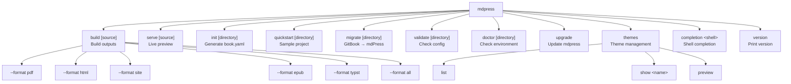

# mdPress Command Manual

[中文说明](COMMANDS_zh.md)

This document summarizes the main `mdpress` commands, global flags, and practical caveats. For command-specific behavior, use the linked subdocuments below.

## Command Hierarchy



## Command Matrix

| Command | Purpose | Doc |
| --- | --- | --- |
| `mdpress build [source]` | Build PDF, HTML, site, or ePub outputs | [build](commands/build.md) |
| `mdpress serve [source]` | Start the local preview server and watch for file changes | [serve](commands/serve.md) |
| `mdpress init [directory]` | Scan Markdown files and generate `book.yaml` | [init](commands/init.md) |
| `mdpress quickstart [directory]` | Create a sample project that can be built immediately | [quickstart](commands/quickstart.md) |
| `mdpress migrate [directory]` | Convert a GitBook/HonKit project to mdPress format | [migrate](commands/migrate.md) |
| `mdpress validate [directory]` | Validate config, chapter files, and referenced assets | [validate](commands/validate.md) |
| `mdpress doctor [directory]` | Check environment readiness and project buildability | [doctor](commands/doctor.md) |
| `mdpress upgrade [flags]` | Check for and install a newer version of mdpress | [upgrade](commands/upgrade.md) |
| `mdpress themes list` | List built-in themes | [themes](commands/themes.md) |
| `mdpress themes show <theme-name>` | Show theme details and config hints | [themes](commands/themes.md) |
| `mdpress themes preview` | Generate an HTML preview of built-in themes | [themes](commands/themes.md) |
| `mdpress completion <shell>` | Generate shell completion scripts | [completion](commands/completion.md) |
| `mdpress version` | Print the version and build information | — |

## Global Flags

These flags appear in `--help` output for most commands.

| Flag | Default | Description |
| --- | --- | --- |
| `--config <path>` | `book.yaml` | Config file path. Mainly relevant for commands that load project config, such as `build`, `serve`, and `validate`. |
| `--cache-dir <path>` | OS default | Override mdPress runtime cache directory. |
| `--no-cache` | off | Disable mdPress runtime caches for this command. Forces a full rebuild. |
| `-v, --verbose` | off | Print more detailed logs and warning-by-warning output. |
| `-q, --quiet` | off | Print errors only. |

`--output <path>` is available on `build` and `serve` (not a global flag).

Notes:

- If `--quiet` and `--verbose` are both set, the current implementation gives precedence to `--quiet`.
- `--config` is a global flag, but not every command actually uses it. `doctor`, `themes`, and `completion` currently ignore it.

## Input Source Rules

mdPress mainly supports two kinds of input:

- Local directories: if `[source]` is omitted, the current directory is used.
- GitHub repository URLs: for example `https://github.com/yeasy/agentic_ai_guide`. For private repositories, set `GITHUB_TOKEN` (see below).

For local directories, config discovery usually follows this order:

1. `book.yaml`
2. `book.json` (GitBook compatibility)
3. `SUMMARY.md`
4. Automatic `.md` file discovery

You can override the SUMMARY.md path with `--summary`:

    mdpress build --summary path/to/SUMMARY.md
    mdpress serve --summary path/to/SUMMARY.md

## GitHub Authentication

To build from private repositories, set the `GITHUB_TOKEN` environment variable before running `mdpress build` or `mdpress serve`:

    export GITHUB_TOKEN=ghp_xxxxxxxxxxxxxxxxxxxx
    mdpress build https://github.com/myorg/private-docs

The token is embedded in the clone URL and never logged. Any GitHub personal access token or fine-grained token with `contents:read` scope will work. When the token is not set and a clone fails, the error message will suggest setting it.

## Outputs And Defaults

- If `build` is called without `--format`, it first checks `output.formats`.
- If `output.formats` is also absent, the default output is `pdf`.
- The special value `--format all` builds all supported formats (PDF, HTML, site, ePub, and Typst).
- The default output filename is derived from the book title (with filesystem-unsafe characters replaced). If the title is empty or "Untitled Book", the project directory name is used instead. You can override this with `output.filename`.
- `serve` writes preview output to `_book/` under the project directory by default.

## Output Configuration

### Table of Contents and Rendering

| Setting | Default | Description |
| --- | --- | --- |
| `output.toc_max_depth` | `2` | Maximum heading level to include in the table of contents (1–6). For example, `2` includes h1 and h2; `3` also includes h3. |
| `output.pdf_timeout` | `120` | Maximum seconds to wait for Chromium to finish rendering a PDF page. Increase for very large books. |

### PDF Watermarks

| Setting | Default | Description |
| --- | --- | --- |
| `output.watermark` | — | Text to overlay on PDF pages. Examples: `"DRAFT"`, `"CONFIDENTIAL"`. |
| `output.watermark_opacity` | `0.1` | Watermark transparency (0.0–1.0). Lower values are more subtle. |

### PDF Margins

| Setting | Default | Description |
| --- | --- | --- |
| `output.margin_top` | `15mm` | Top page margin. Examples: `"20mm"`, `"0.8in"`, `"2cm"`. |
| `output.margin_bottom` | `15mm` | Bottom page margin. |
| `output.margin_left` | `20mm` | Left page margin. |
| `output.margin_right` | `20mm` | Right page margin. |

### PDF Bookmarks

| Setting | Default | Description |
| --- | --- | --- |
| `output.generate_bookmarks` | `true` | Auto-generate PDF bookmarks from heading hierarchy. Improves navigation in PDF readers. |

### Environment Variables

| Variable | Default | Description |
| --- | --- | --- |
| `MDPRESS_CHROME_PATH` | auto-detect | Absolute path to a Chrome or Chromium binary. When set, mdPress skips auto-detection and uses this path directly. |

Example `book.yaml` snippet:

    output:
      toc_max_depth: 3
      pdf_timeout: 300
      watermark: "DRAFT"
      watermark_opacity: 0.15
      margin_top: "20mm"
      margin_bottom: "20mm"
      margin_left: "25mm"
      margin_right: "25mm"
      generate_bookmarks: true

Example environment variable usage:

    MDPRESS_CHROME_PATH=/usr/bin/chromium mdpress build --format pdf

## Typst Backend

mdPress supports the Typst typesetting system as an alternative PDF backend, offering zero external dependencies:

    mdpress build --format typst

**Requirements**: The `typst` CLI must be installed on your system. Visit [typst.app](https://typst.app) for installation instructions.

**Advantages over Chromium**:
- No external browser dependency (Chromium not required)
- Faster native PDF compilation
- Professional typesetting quality

**Note**: If `typst` is not installed, the command will fail. For systems without Typst, continue using the default Chromium backend.

## PlantUML Diagram Support

mdPress automatically detects and renders PlantUML diagrams in markdown code blocks:

    ```plantuml
    @startuml
    Alice -> Bob: Hello
    @enduml
    ```

PlantUML diagrams are rendered as SVG or PNG in HTML-based outputs and embedded in PDF/ePub formats.

**Requirements**: For full support, ensure PlantUML is installed. If not available, diagrams will be rendered as code blocks.

## Parallel Builds and Build Cache

mdPress automatically uses multiple CPU cores when building multi-chapter books:

- **Automatic parallelization**: No configuration needed. Chapter parsing automatically uses available CPU cores.
- **Build cache**: mdPress maintains a `.mdpress-cache/` directory with chapter hashes and compiled content. Unchanged chapters are reused on subsequent builds.
- **Force full rebuild**: Use `mdpress build --no-cache` to skip the cache and rebuild all chapters.

This can reduce rebuild times significantly, especially for large books with many chapters.

## Boundaries Of Auto-Discovery

Auto-discovery works well when one directory is clearly one book or one documentation set. It is not a good fit for a large repository root.

Typical risks:

- The repository root `README.md` may become chapter one.
- `docs/`, `examples/`, `tests/`, and internal design notes may all enter the chapter list.
- The build may succeed, but the resulting information architecture is often not what you actually want.

Recommended approach:

- Run commands in the real docs subdirectory, for example `mdpress serve ./docs`.
- Or provide an explicit `book.yaml` or `SUMMARY.md`.

## Troubleshooting

- For command boundaries and behavior, start with [serve](commands/serve.md) and [build](commands/build.md).

## Suggested Reading Order

- For a quick start, read [build](commands/build.md) and [serve](commands/serve.md) first.
- For integrating an existing repository, continue with [init](commands/init.md) and [validate](commands/validate.md).
- For environment troubleshooting, read [doctor](commands/doctor.md).
- For theming, read [themes](commands/themes.md).
