# mdPress 命令手册

[English](COMMANDS.md)

本文档汇总 `mdpress` 的所有主要命令、全局参数和常见注意事项。更细的说明见下方分命令文档。

## 命令层级

```mermaid
flowchart TD
    root["mdpress"]

    root --> build["build [source]<br/>构建输出"]
    root --> serve["serve [source]<br/>实时预览"]
    root --> init["init [directory]<br/>生成 book.yaml"]
    root --> quickstart["quickstart [directory]<br/>示例项目"]
    root --> migrate["migrate [directory]<br/>GitBook 转 mdPress"]
    root --> validate["validate [directory]<br/>校验配置"]
    root --> doctor["doctor [directory]<br/>环境检查"]
    root --> config["config<br/>查看解析后的配置"]
    root --> cache["cache<br/>构建缓存"]
    root --> upgrade["upgrade<br/>更新 mdpress"]
    root --> themes["themes<br/>主题管理"]
    root --> completion["completion &lt;shell&gt;<br/>补全脚本"]
    root --> version["version<br/>版本信息"]

    themes --> list["list"]
    themes --> show["show &lt;name&gt;"]
    themes --> preview["preview"]

    config --> configshow["show"]
    cache --> cacheinfo["info"]
    cache --> cacheclear["clear"]

    build --> pdf["--format pdf"]
    build --> html["--format html"]
    build --> site["--format site"]
    build --> epub["--format epub"]
    build --> typst["--format typst"]
    build --> all["--format all"]
```



## 命令矩阵

| 命令 | 作用 | 文档 |
| --- | --- | --- |
| `mdpress build [source]` | 构建 PDF、HTML、站点或 ePub | [build](commands/build_zh.md) |
| `mdpress serve [source]` | 启动本地预览服务并监听文件变化 | [serve](commands/serve_zh.md) |
| `mdpress init [directory]` | 扫描 Markdown 并生成 `book.yaml` | [init](commands/init_zh.md) |
| `mdpress quickstart [directory]` | 创建可直接构建的示例项目 | [quickstart](commands/quickstart_zh.md) |
| `mdpress migrate [directory]` | 将 GitBook/HonKit 项目转换为 mdPress 格式 | [migrate](commands/migrate_zh.md) |
| `mdpress validate [directory]` | 校验配置、章节文件和引用资源 | [validate](commands/validate_zh.md) |
| `mdpress doctor [directory]` | 检查运行环境和项目可构建性 | [doctor](commands/doctor_zh.md) |
| `mdpress config show [directory]` | 打印构建时实际生效的配置 | [config](commands/config_zh.md) |
| `mdpress cache info` | 查看缓存位置、条目数和占用大小 | [cache](commands/cache_zh.md) |
| `mdpress cache clear` | 删除全部缓存条目 | [cache](commands/cache_zh.md) |
| `mdpress upgrade [flags]` | 检查并安装 mdpress 的新版本 | [upgrade](commands/upgrade_zh.md) |
| `mdpress themes list` | 列出内置主题 | [themes](commands/themes_zh.md) |
| `mdpress themes show <theme-name>` | 查看主题详情和配置提示 | [themes](commands/themes_zh.md) |
| `mdpress themes preview` | 生成内置主题的 HTML 预览页 | [themes](commands/themes_zh.md) |
| `mdpress completion <shell>` | 生成自动补全脚本 | [completion](commands/completion_zh.md) |
| `mdpress version` | 打印版本号和构建信息（加 `--json` 供脚本使用） | — |

## 全局参数

以下参数会显示在大多数命令的 `--help` 中。

| 参数 | 默认值 | 说明 |
| --- | --- | --- |
| `--config <path>` | `book.yaml` | 配置文件路径。主要对会加载配置的命令有效，例如 `build`、`serve`、`validate`。 |
| `--cache-dir <path>` | 系统默认 | 覆盖 mdPress 运行时缓存目录。 |
| `--no-cache` | 关闭 | 禁用当前命令的 mdPress 运行时缓存。强制全量重建。 |
| `-v, --verbose` | 关闭 | 输出更详细的日志和逐条警告。 |
| `-q, --quiet` | 关闭 | 只输出错误信息。 |

`--output <path>` 可在 `build` 和 `serve` 中使用（不是全局参数）。

注意：

- 如果同时传入 `--quiet` 和 `--verbose`，当前实现以 `--quiet` 为准。
- `--config` 虽然是全局参数，但并不是每个命令都会真正使用它。`doctor`、`themes`、`completion` 等命令当前不会按这个参数切换配置文件。

## 输入源规则

mdPress 主要支持两类输入源：

- 本地目录：省略 `[source]` 时默认使用当前目录
- GitHub 仓库 URL：例如 `https://github.com/yeasy/agentic_ai_guide`。私有仓库需设置 `GITHUB_TOKEN`（见下文）

对于本地目录，配置解析优先级通常是：

1. `book.yaml`
2. `book.json`（GitBook 兼容）
3. `SUMMARY.md`
4. 自动扫描 `.md` 文件

可通过 `--summary` 指定 SUMMARY.md 路径：

    mdpress build --summary path/to/SUMMARY.md
    mdpress serve --summary path/to/SUMMARY.md

## GitHub 认证

如需从私有仓库构建，在运行 `mdpress build` 或 `mdpress serve` 前设置 `GITHUB_TOKEN` 环境变量：

    export GITHUB_TOKEN=ghp_xxxxxxxxxxxxxxxxxxxx
    mdpress build https://github.com/myorg/private-docs

Token 不会被嵌入 clone URL。mdPress 始终 clone 普通的 `https://github.com/<owner>/<repo>.git`，并通过 `http.<base>.extraheader` 这个 git config 环境变量注入凭据（与 `actions/checkout` 使用的机制相同）。因此 token 不会出现在进程表（`ps`、`/proc/<pid>/cmdline`）中，不会写入临时 clone 的 `.git/config`，也不会出现在日志里——git 输出中若含 token，mdPress 会先脱敏再记录。

任何具有 `contents:read` 权限的 GitHub 个人访问令牌或细粒度令牌均可使用。未设置 token 时 clone 失败，错误信息会提示设置此变量。

## 输出与默认值

- `build` 如果没有显式传 `--format`，会先读取 `output.formats`。
- 如果配置里也没有 `output.formats`，默认构建 `pdf`。
- 特殊值 `--format all` 会构建 pdf、html、site、epub，不包含 `typst`：它依赖可选的 Typst CLI，且产物与 `pdf` 相同，需要时请用 `--format typst` 显式指定。
- 默认输出文件名根据书籍标题自动生成（文件系统不安全字符会被替换）。如果标题为空或为 "Untitled Book"，则使用项目目录名。你可以通过 `output.filename` 手动覆盖。
- `serve` 默认把预览产物写到项目目录下的 `_book/`。

## 输出配置

### 目录和渲染

| 配置项 | 默认值 | 说明 |
| --- | --- | --- |
| `output.toc_max_depth` | `2` | 目录中包含的最大标题层级（1–6）。例如 `2` 表示包含 h1 和 h2；`3` 还会包含 h3。 |
| `output.pdf_timeout` | `120` | 等待 Chromium 完成 PDF 页面渲染的最大秒数。对于很大的书籍可以增加此值。 |

### PDF 水印

| 配置项 | 默认值 | 说明 |
| --- | --- | --- |
| `output.watermark` | — | 叠加在 PDF 页面上的文本。示例：`"DRAFT"`、`"CONFIDENTIAL"`。 |
| `output.watermark_opacity` | `0.1` | 水印透明度（0.0–1.0）。数值越小越透明。 |

### PDF 页边距

| 配置项 | 默认值 | 说明 |
| --- | --- | --- |
| `output.margin_top` | `15mm` | 页面上边距。示例：`"20mm"`、`"0.8in"`、`"2cm"`。 |
| `output.margin_bottom` | `15mm` | 页面下边距。 |
| `output.margin_left` | `20mm` | 页面左边距。 |
| `output.margin_right` | `20mm` | 页面右边距。 |

### PDF 书签

| 配置项 | 默认值 | 说明 |
| --- | --- | --- |
| `output.generate_bookmarks` | `true` | 从标题层级自动生成 PDF 书签，增强 PDF 阅读器中的导航体验。 |
| `output.tagged_pdf` | `true` | 生成可访问的带标签 PDF。设为 `false` 可显著减小文件体积。 |

### 站点输出

| 配置项 | 默认值 | 说明 |
| --- | --- | --- |
| `output.site_url` | 未设置 | 部署站点的公开基础 URL（如 `https://user.github.io/repo`）。设置后生成符合规范的 `sitemap.xml`；不设置则不生成。 |
| `output.edit_base` | 未设置 | "编辑此页"链接的基础 URL（如 `https://github.com/user/repo/edit/main/`）。 |
| `output.footer_html` | 未设置 | 替换站点页脚默认的 "Built with mdPress" 一行。显式设为空字符串会彻底移除该行。按原始 HTML 输出。 |
| `output.show_theme_badge` | `false` | 在站点侧边栏中把主题名渲染成一个徽章。 |
| `book.favicon` | 未设置 | 站点图标：项目相对的图片路径或绝对 URL。不设置则使用内置的书本 emoji。 |
| `book.logo` | 未设置 | 站点侧边栏标题上方的图片。 |
| `book.copyright` | 未设置 | 渲染在每个站点页面页脚的简短声明，如 `© 2026 Acme Inc.`。 |

与 `book.yaml` 并列的 `static/` 目录中的内容会被原样复制到站点根目录。项目就是靠它来携带
`CNAME`、`.nojekyll`、自定义的 `robots.txt` 以及其他 mdPress 不会生成的文件。不要手工把这类
文件放进 `_book/` —— 下一次构建会原子地替换那个目录并销毁它们。

### Markdown 与变量

| 配置项 | 默认值 | 说明 |
| --- | --- | --- |
| `markdown.allow_html` | `true` | Markdown 中书写的原始 HTML 是否进入输出。对于渲染他人所写 Markdown 的项目请设为 `false`；此时每个 HTML 块都会变成 `<!-- raw HTML omitted -->` 注释。 |
| `variables` | 空 | 用户自定义的模板变量，可在 Markdown 中以 `{{ key }}` 使用。替换会跳过围栏代码块和行内代码。 |

### 环境变量

| 变量 | 默认值 | 说明 |
| --- | --- | --- |
| `MDPRESS_CHROME_PATH` | 自动检测 | Chrome 或 Chromium 二进制文件的绝对路径。设置后，mdPress 会跳过自动检测直接使用此路径。 |
| `MDPRESS_CACHE_DIR` | 系统临时目录 | 构建缓存位置，等价于 `--cache-dir`。在 CI 中把它指向工作区内部，任务才能恢复缓存。 |

`book.yaml` 配置示例：

    output:
      toc_max_depth: 3
      pdf_timeout: 300
      watermark: "DRAFT"
      watermark_opacity: 0.15
      margin_top: "20mm"
      margin_bottom: "20mm"
      margin_left: "25mm"
      margin_right: "25mm"
      generate_bookmarks: true

环境变量使用示例：

    MDPRESS_CHROME_PATH=/usr/bin/chromium mdpress build --format pdf

## Typst 后端

mdPress 支持使用 Typst 排版系统作为另一种 PDF 生成方案，可实现零外部依赖：

    mdpress build --format typst

**要求**：系统上必须安装 `typst` CLI。访问 [typst.app](https://typst.app) 获取安装说明。

**相比 Chromium 的优势**：
- 无需外部浏览器依赖（不需要 Chromium）
- 原生 PDF 编译速度更快
- 专业级排版质量

**说明**：如果未安装 Typst，命令会失败。在不支持 Typst 的系统上，请继续使用默认的 Chromium 后端。

## PlantUML 图表不会被渲染

mdPress **不**渲染 PlantUML。```plantuml 代码块在所有输出格式中都按普通代码块
发布，本该是图的位置会显示图的源码。

请改用：

- **```mermaid** —— mdPress 会在 site、单页 HTML 和 PDF 输出中渲染它。
- **预先渲染的图片** —— 自行运行 PlantUML，然后引用产物：

      

`mdpress build` 会为每个 PlantUML 代码块发出一次警告，`mdpress doctor` 也会
报告它们的存在，所以这一点不会被忽略。

## 并行构建和构建缓存

mdPress 在构建多章节书籍时自动使用多个 CPU 核心：

- **自动并行化**：无需配置。章节解析会自动利用所有可用 CPU 核心。
- **构建缓存**：mdPress 维护缓存目录（默认：`$TMPDIR/mdpress-cache`），记录章节 hash 和编译产物。未改动的章节会在后续构建中直接复用。使用 `--cache-dir` 覆盖。
- **强制全量重建**：使用 `mdpress build --no-cache` 跳过缓存并重新编译所有章节。

这可以大幅缩短重建时间，尤其是对于有很多章节的大型书籍。

## 自动发现的边界

自动发现适合“一个目录就是一本书”或“一个目录就是一套文档”的场景，不适合直接套在复杂代码仓库根目录上。

典型风险：

- 仓库根目录的 `README.md` 会被当作第一章
- `docs/`、`examples/`、`tests/`、内部设计文档等 Markdown 可能一起进入章节列表
- 结果虽然能构建，但信息架构通常不是你真正想要的网站

推荐做法：

- 在文档子目录下执行命令，例如 `mdpress serve ./docs`
- 或者为目标目录显式编写 `book.yaml` / `SUMMARY.md`

## 故障排查

- 想看具体命令边界，优先看 [serve](commands/serve_zh.md) 和 [build](commands/build_zh.md)

## 推荐阅读顺序

- 想快速上手：先看 [build](commands/build_zh.md) 和 [serve](commands/serve_zh.md)
- 想接入已有仓库：再看 [init](commands/init_zh.md) 与 [validate](commands/validate_zh.md)
- 想排查环境问题：看 [doctor](commands/doctor_zh.md)
- 想了解主题：看 [themes](commands/themes_zh.md)
