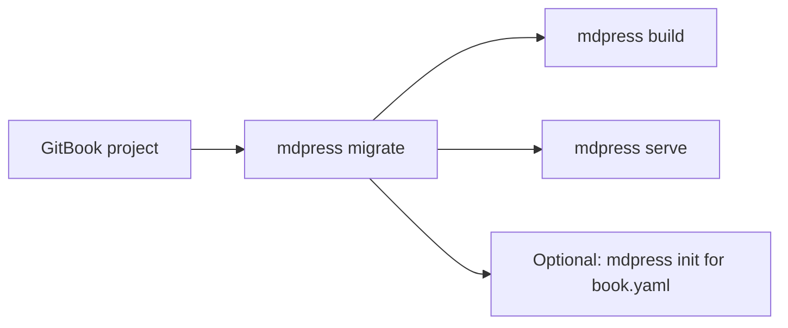

# Migrating from GitBook to mdPress

## Quick Overview

GitBook projects are organized around Markdown files plus `SUMMARY.md`. mdPress supports `SUMMARY.md` natively, so a large part of the migration path is simply pointing `mdpress` at the existing project and building it.



## Step-by-Step Migration

### 1. Install mdPress

```bash
go install github.com/yeasy/mdpress@latest
# or download from https://github.com/yeasy/mdpress/releases
```

### 2. Run the Automated Migration

The `migrate` command converts `book.json` to `book.yaml` and rewrites GitBook-specific template tags (``, ``, ``):

```bash
mdpress migrate
```

Use `--dry-run` to preview changes without modifying files.

### 3. Build and Preview

Navigate to your existing GitBook project and run:

```bash
mdpress build
mdpress serve
```

`mdpress build` automatically detects `SUMMARY.md`. `mdpress serve` gives you a local preview loop with automatic browser reloads.

If your `SUMMARY.md` is not in the project root, you can point to it explicitly:

```bash
mdpress build --summary path/to/SUMMARY.md
mdpress serve --summary path/to/SUMMARY.md
```

### 4. (Optional) Initialize Configuration

For more control over themes, styling, or metadata, create a `book.yaml` configuration file:

```bash
mdpress init
```

This generates a `book.yaml` template with options for:

- Book metadata (title, author, language)
- Theme selection and custom CSS
- Output format preferences
- Cover image settings

Edit `book.yaml` and run `mdpress build` again.

## Feature Mapping

| GitBook Feature | mdPress Equivalent | Notes |
|---|---|---|
| SUMMARY.md structure | Supported natively | Same format accepted |
| book.json metadata | book.yaml | YAML format instead of JSON |
| Theme selection | `style.theme` in `book.yaml` | Built-in themes plus custom CSS |
| Custom CSS | `style.custom_css` | Add project-specific styling |
| Cover image | `book.cover.image` | Supports SVG and image files |
| PDF generation | `mdpress build --format pdf` | Chromium-backed PDF output |
| EPUB generation | `mdpress build --format epub` | ePub output from the same source |
| HTML/Site output | `mdpress build --format html` / `site` | Single-page HTML or multi-page site |
| Live preview | `mdpress serve` | Local preview server with auto reload |
| Syntax highlighting | Automatic | Supported for 100+ languages |
| Table of contents | Auto-generated | From headings in Markdown |

## Known Differences and Limitations

1. **Configuration Format**: GitBook uses `book.json` (JSON). mdPress uses `book.yaml` (YAML).
2. **Plugin System**: GitBook's plugin ecosystem is not available in mdPress. Core features are built-in.
3. **Live Preview**: mdPress has its own `serve` command for local preview and auto reload.
4. **Theme System**: mdPress includes fewer built-in themes than GitBook-style ecosystems. Custom CSS is the recommended path when you need brand-specific appearance.
5. **Internationalization**: mdPress supports language metadata, but auto-translation features are not built-in.
6. **Variable Substitution**: `mdpress migrate` rewrites common GitBook tags (``, ``, ``). General Jinja/Nunjucks templating (e.g., ``, variables) is not supported; use pure Markdown instead.

## Example Commands

```bash
# Build PDF (default format)
mdpress build

# Generate only PDF
mdpress build --format pdf

# Generate only EPUB
mdpress build --format epub

# Build multi-page HTML site
mdpress build --format site

# Start local preview
mdpress serve

# Specify output directory
mdpress build --output ./my-output
```

## Troubleshooting

**Issue**: Images in SUMMARY.md not showing
**Solution**: Ensure image paths are relative to the markdown file location.

**Issue**: Configuration not being read
**Solution**: Verify `book.yaml` is in the project root and has correct YAML syntax.

**Issue**: PDF generation fails
**Solution**: Check that all required system dependencies are installed (see README for OS-specific requirements).

**Issue**: The chapter list looks wrong
**Solution**: Verify that `SUMMARY.md` reflects the order you expect. If you need more metadata or styling control, add `book.yaml` with `mdpress init`.

## Next Steps

- Review the [README](../README.md) for full feature documentation
- Check [examples](../examples) directory for sample projects
- See [CONTRIBUTING.md](../CONTRIBUTING.md) for development guidelines
