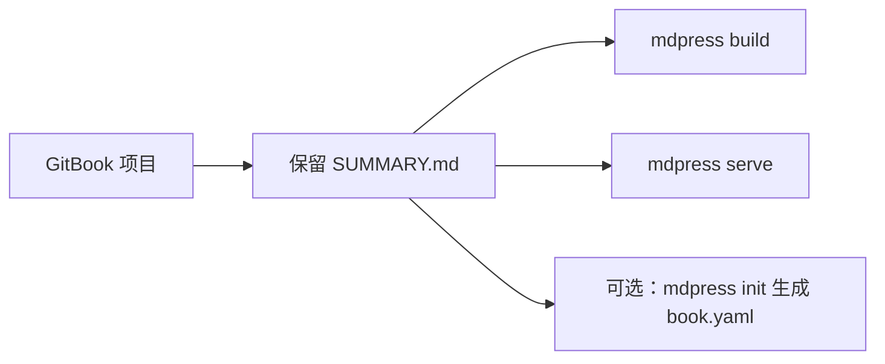

# 从 GitBook 迁移到 mdPress

## 快速概览

GitBook 项目本质上就是一组 Markdown 文件加 `SUMMARY.md`。mdPress 原生支持 `SUMMARY.md`，所以迁移路径通常很直接：保留原有目录结构，直接开始构建和预览。



## 分步迁移指南

### 1. 安装 mdPress

```bash
go install github.com/yeasy/mdpress@latest
# 或从 https://github.com/yeasy/mdpress/releases 下载
```

### 2. 在 GitBook 目录中运行 mdPress

导航到你现有的 GitBook 项目目录并运行：

```bash
mdpress build
mdpress serve
```

`mdpress build` 会自动检测 `SUMMARY.md`。`mdpress serve` 则提供本地预览和自动刷新循环。

如果 `SUMMARY.md` 不在项目根目录，可以显式指定路径：

```bash
mdpress build --summary path/to/SUMMARY.md
mdpress serve --summary path/to/SUMMARY.md
```

### 3. （可选）初始化配置文件

如需更多控制权（如主题、样式或元数据），可创建 `book.yaml` 配置文件：

```bash
mdpress init
```

此命令生成 `book.yaml` 模板，包含以下选项：

- 书籍元数据（标题、作者、语言）
- 主题选择和自定义 CSS
- 输出格式偏好
- 封面图像设置

编辑 `book.yaml` 后再次运行 `mdpress build`。

## 功能对应表

| GitBook 功能 | mdPress 对应功能 | 备注 |
|---|---|---|
| SUMMARY.md 结构 | 原生支持 | 接受相同格式 |
| book.json 元数据 | book.yaml | YAML 格式替代 JSON |
| 主题选择 | `book.yaml` 中的 `style.theme` | 内置主题，可叠加自定义 CSS |
| 自定义 CSS | `style.custom_css` | 注入项目自己的样式 |
| 封面图像 | `book.cover.image` | 支持 SVG 和常见图像文件 |
| PDF 生成 | `mdpress build --format pdf` | 基于 Chromium 的 PDF 输出 |
| EPUB 生成 | `mdpress build --format epub` | 同一份内容直接出 ePub |
| HTML/网站输出 | `mdpress build --format html` / `site` | 单页 HTML 或多页站点 |
| 实时预览 | `mdpress serve` | 本地预览服务器 + 自动刷新 |
| 语法高亮 | 自动 | 支持 100+ 种语言 |
| 目录 | 自动生成 | 从 Markdown 标题生成 |

## 已知差异和限制

1. **配置格式**：GitBook 使用 `book.json`（JSON）。mdPress 使用 `book.yaml`（YAML）。
2. **插件系统**：GitBook 的插件生态在 mdPress 中不可用。核心功能已内置。
3. **实时预览**：mdPress 自带 `serve` 命令，负责本地预览和自动刷新。
4. **主题系统**：mdPress 内置主题数量少于 GitBook 生态，但主要能力都在。需要品牌化外观时，建议走自定义 CSS。
5. **国际化**：mdPress 支持语言元数据，但不内置自动翻译功能。
6. **变量替换**：GitBook 的模板变量（如 ``）不支持；使用纯 Markdown 替代。

## 示例命令

```bash
# 构建所有格式
mdpress build

# 仅生成 PDF
mdpress build --format pdf

# 仅生成 EPUB
mdpress build --format epub

# 构建多页 HTML 网站
mdpress build --format site

# 启动本地预览
mdpress serve

# 指定输出目录
mdpress build --output ./my-output
```

## 故障排除

**问题**：SUMMARY.md 中的图像未显示
**解决方案**：确保图像路径相对于 markdown 文件位置。

**问题**：配置未被读取
**解决方案**：验证 `book.yaml` 在项目根目录中，且 YAML 语法正确。

**问题**：PDF 生成失败
**解决方案**：检查是否安装了所有必需的系统依赖项（参考 README 了解特定操作系统的要求）。

**问题**：章节顺序不对
**解决方案**：先确认 `SUMMARY.md` 的目录顺序是否符合预期；如果需要更细的元数据或样式控制，再通过 `mdpress init` 增加 `book.yaml`。

## 下一步

- 查看 [README](../README.md) 了解完整的功能文档
- 查看 [examples](../examples) 目录了解示例项目
- 参考 [CONTRIBUTING.md](../CONTRIBUTING.md) 了解开发指南
