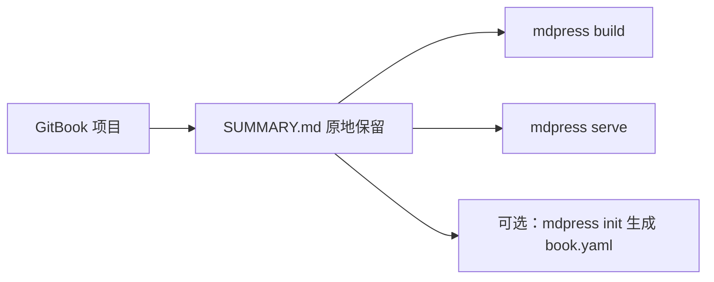

# 从 GitBook 迁移到 mdPress

[English](MIGRATION_FROM_GITBOOK.md)

## 快速概览

GitBook 项目围绕 Markdown 文件和 `SUMMARY.md` 组织。mdPress 本地支持 `SUMMARY.md`，所以迁移路径大部分只需让 `mdpress` 指向现有项目然后构建即可。



## 分步迁移指南

### 1. 安装 mdPress

```bash
go install github.com/yeasy/mdpress@latest
# 或从 https://github.com/yeasy/mdpress/releases 下载
```

### 2. 在 GitBook 目录中运行 mdPress

进入现有 GitBook 项目目录并运行：

```bash
mdpress build
mdpress serve
```

`mdpress build` 会自动检测 `SUMMARY.md`。`mdpress serve` 提供本地预览循环，并支持自动浏览器刷新。

如果 `SUMMARY.md` 不在项目根目录，可以显式指向它：

```bash
mdpress build --summary path/to/SUMMARY.md
mdpress serve --summary path/to/SUMMARY.md
```

### 3. （可选）初始化配置

如需对主题、样式或元数据有更多控制，可创建 `book.yaml` 配置文件：

```bash
mdpress init
```

这会生成包含以下选项的 `book.yaml` 模板：

- 书籍元数据（标题、作者、语言）
- 主题选择和自定义 CSS
- 输出格式偏好设置
- 封面图片设置

编辑 `book.yaml` 后重新运行 `mdpress build`。

## 功能映射

| GitBook 功能 | mdPress 对应功能 | 说明 |
|---|---|---|
| SUMMARY.md 结构 | 本地支持 | 接受相同格式 |
| book.json 元数据 | book.yaml | YAML 格式代替 JSON |
| 主题选择 | `book.yaml` 中的 `style.theme` | 内置主题加自定义 CSS |
| 自定义 CSS | `style.custom_css` | 添加项目特定样式 |
| 封面图片 | `book.cover.image` | 支持 SVG 和图像文件 |
| PDF 生成 | `mdpress build --format pdf` | Chromium 支持的 PDF 输出 |
| EPUB 生成 | `mdpress build --format epub` | ePub 输出，使用相同源 |
| HTML/站点输出 | `mdpress build --format html` / `site` | 单页 HTML 或多页站点 |
| 实时预览 | `mdpress serve` | 本地预览服务器，自动刷新 |
| 语法高亮 | 自动 | 支持 100+ 种语言 |
| 目录 | 自动生成 | 从 Markdown 标题生成 |

## 已知差异和限制

1. **配置格式**：GitBook 使用 `book.json`（JSON）。mdPress 使用 `book.yaml`（YAML）。
2. **插件系统**：mdPress 中没有 GitBook 的插件生态系统。核心功能是内置的。
3. **实时预览**：mdPress 有自己的 `serve` 命令用于本地预览和自动刷新。
4. **主题系统**：mdPress 包含的内置主题比 GitBook 风格的生态少。需要品牌特定外观时，推荐使用自定义 CSS。
5. **国际化**：mdPress 支持语言元数据，但不内置自动翻译功能。
6. **变量替换**：不支持 GitBook 的模板变量（如 ``）；请使用纯 Markdown。

## 示例命令

```bash
# 构建所有格式
mdpress build

# 仅生成 PDF
mdpress build --format pdf

# 仅生成 EPUB
mdpress build --format epub

# 构建多页 HTML 站点
mdpress build --format site

# 启动本地预览
mdpress serve

# 指定输出目录
mdpress build --output ./my-output
```

## 故障排查

**问题**：SUMMARY.md 中的图片不显示

**解决方案**：确保图片路径是相对于 Markdown 文件位置的。

---

**问题**：配置没有被读取

**解决方案**：验证 `book.yaml` 在项目根目录且有正确的 YAML 语法。

---

**问题**：PDF 生成失败

**解决方案**：检查所有必需的系统依赖是否已安装（见 README 中的操作系统特定要求）。

---

**问题**：章节列表显示不正确

**解决方案**：验证 `SUMMARY.md` 反映的顺序是否符合预期。如需更多元数据或样式控制，用 `mdpress init` 添加带有 `book.yaml` 的配置。

## 后续步骤

- 查阅 [README](../README_zh.md) 了解完整功能文档
- 查看 [examples](../examples) 目录获取示例项目
- 查阅 [CONTRIBUTING_zh.md](../CONTRIBUTING_zh.md) 了解开发指南
