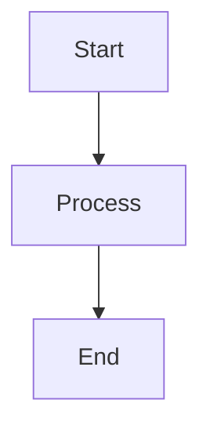
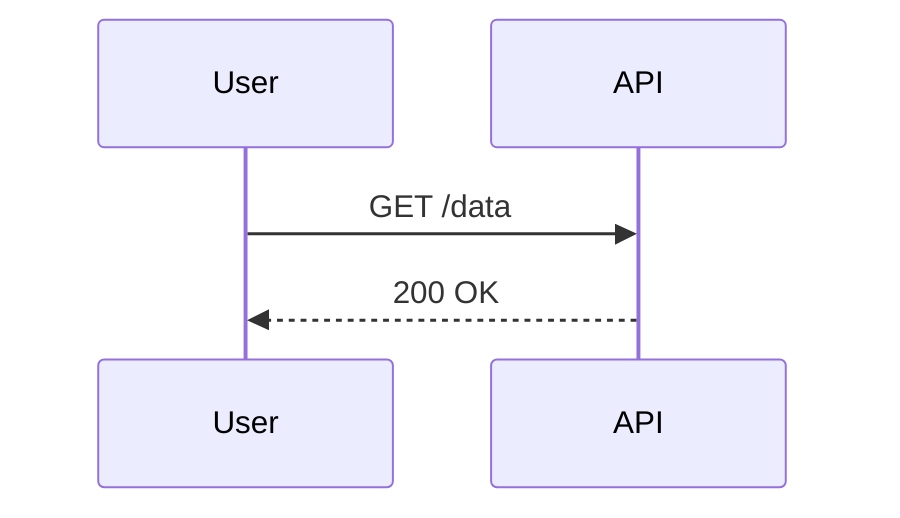

# Common Issues and Solutions

This guide addresses the most frequently encountered problems when building with mdPress and provides straightforward solutions.

## Chrome Not Found

**Error message:**
```
Error: Chrome binary not found. Please install Chrome or Chromium
and set MDPRESS_CHROME_PATH to its path.
```

**Causes:**
- Chrome/Chromium not installed on system
- mdPress can't auto-detect Chrome location

**Solutions:**

### Install Chrome

**Ubuntu/Debian:**
```bash
sudo apt-get update
sudo apt-get install -y chromium-browser
# or
sudo apt-get install -y google-chrome-stable
```

**macOS:**
```bash
brew install chromium
# or
brew install google-chrome
```

**Windows:**
Download from https://www.google.com/chrome/

**Alpine (Docker):**
```dockerfile
RUN apk add --no-cache chromium
```

### Manually Specify Chrome Path

If installed but not auto-detected:

```bash
# Linux/macOS
export MDPRESS_CHROME_PATH=/usr/bin/chromium
mdpress build --format pdf

# Windows (PowerShell)
$env:MDPRESS_CHROME_PATH="C:\Program Files\Google\Chrome\Application\chrome.exe"
mdpress.exe build --format pdf
```

Find Chrome location:

```bash
# Linux
which chromium
which chromium-browser
which google-chrome

# macOS
which chromium
/Applications/Chromium.app/Contents/MacOS/Chromium

# Windows
"C:\Program Files\Google\Chrome\Application\chrome.exe"
```

### Use Typst Instead

If you can't install Chrome, use Typst as an alternative PDF backend:

```bash
# Install Typst (see https://typst.app)
# Then build with:
mdpress build --format typst
```

Typst doesn't require Chrome and is faster.

## CJK Characters Look Wrong in PDF

**Symptoms:**
- Chinese characters display as boxes or corrupted text
- Japanese characters missing or incorrect
- Korean text rendering issues

**Causes:**
- CJK (Chinese, Japanese, Korean) fonts not installed
- Font fallback to incompatible typeface

**Solution:**

### Install CJK Fonts

**Ubuntu/Debian:**
```bash
sudo apt-get install -y fonts-noto-cjk fonts-noto-cjk-extra
# or
sudo apt-get install -y fonts-wqy-microhei fonts-wqy-zenhei
```

**macOS:**
```bash
brew install font-noto-sans-cjk
```

**Alpine (Docker):**
```dockerfile
RUN apk add --no-cache font-noto-cjk
```

**Windows:**
- Download Noto Sans CJK from https://www.google.com/get/noto/
- Install fonts via Control Panel → Fonts

### Specify Font in book.yaml

```yaml
style:
  font_family: "Noto Sans CJK SC, -apple-system, BlinkMacSystemFont, sans-serif"
  # Options:
  # - "Noto Sans CJK SC" (Chinese Simplified)
  # - "Noto Sans CJK TC" (Chinese Traditional)
  # - "Noto Sans CJK JP" (Japanese)
  # - "Noto Sans CJK KR" (Korean)
```

### Verify Font Installation

```bash
# List installed fonts (Linux)
fc-list | grep -i "noto"

# Verify font is available
fc-match "Noto Sans CJK SC"
```

## Broken Internal Links

**Error message:**
```
[WARN] Broken link: ../getting-started/setup.md (not found)
```

**Causes:**
- Incorrect relative path
- File renamed or moved
- Case sensitivity issues (especially on Linux)

**Solution:**

### Use mdpress validate

Catch broken links before building:

```bash
mdpress validate

# Output:
# Validating configuration...
# Checking chapter files...
# Checking cross-references...
# [ERROR] Chapter 2 references missing file: ../api/endpoints.md
```

### Fix Link Paths

Verify and correct all relative links:

```markdown
# Before (broken)
See [API Reference](api-reference.md)      # File is in ../reference/
See [Setup Guide](./setup.md)              # File is in ../intro/

# After (correct)
See [API Reference](../reference/api.md)
See [Setup Guide](../intro/setup.md)
```

Path rules:
- Use `../` to go up one directory
- Use `./` or no prefix for same directory
- Paths are relative to the Markdown file location

### Case Sensitivity

On Linux/macOS, file paths are case-sensitive:

```
# Linux/macOS: ✗ These are different
Chapter.md
chapter.md

# Windows: These are the same

# Fix: Use exact case
ln -s setup.md Setup.md  # Rename to match
```

### Validate in book.yaml

Ensure all chapter file references exist:

```yaml
chapters:
  - title: "Introduction"
    file: "intro.md"      # Check: does intro.md exist?
  - title: "Getting Started"
    file: "chapters/getting-started.md"  # Check: path correct?
```

## Slow Builds

**Symptoms:**
- First build takes 5+ minutes
- Subsequent builds also slow
- Resources: CPU/memory not fully utilized

**Causes:**
- Cache disabled or corrupted
- Very large chapters
- Slow disk (network mounts, spinning disk)
- Single-core processing

**Solutions:**

### Enable Caching

Caching is default, but verify it's working:

```bash
# First build (slow, creates cache)
time mdpress build --format pdf
# Output: real    2m15.123s

# Second build (cached, should be fast)
time mdpress build --format pdf
# Output: real    0m3.456s

# If second build is slow, cache may be disabled
```

### Force Cache Refresh

If builds seem stale:

```bash
mdpress build --format pdf --no-cache
```

This rebuilds everything from scratch (slow) and refreshes the cache.

### Use HTML Format During Development

HTML builds much faster than PDF:

```bash
# Development: fast
mdpress serve

# Final build: slower but needed
mdpress build --format pdf
```

### Check Disk Performance

Test disk speed:

```bash
# Linux/macOS
time dd if=/dev/zero of=test.img bs=1M count=100
# Good: >100 MB/s
# Bad: <10 MB/s (network mount or old disk)

# Windows (PowerShell)
Measure-Command { 1..100 | % { [System.IO.File]::WriteAllText("test.txt", "x" * 1MB) } }
```

If disk is slow:
- Use `--cache-dir /tmp/mdpress-cache` (faster local disk)
- Avoid network mounts (NFS, SMB) for cache
- On servers, use SSD storage

### Parallelize (Automatic)

mdPress automatically uses all CPU cores. If builds aren't parallel:

```bash
# Check cores available
nproc              # Linux/macOS
Get-CimInstance Win32_Processor | select ThreadCount  # Windows
```

mdPress uses all available cores automatically, so multi-core systems should be faster.

### Reduce Book Size

For books exceeding 100+ chapters:

```bash
# Check chapter sizes
wc -l *.md | sort -n | tail -20

# Split largest chapters
# Example: split 50-page chapter into two 25-page chapters
# See organizing-large-books.md for structure tips
```

## Blank or Missing PDF Pages

**Symptoms:**
- Output PDF has blank pages
- Some chapters missing from PDF
- PDF is much smaller than expected

**Causes:**
- Chrome crash during rendering
- Large images causing timeout
- Memory exhaustion
- Corrupted cache

**Solutions:**

### Increase PDF Timeout

```yaml
output:
  pdf_timeout: 300  # Increase from default 120 seconds
```

For very large books:

```yaml
output:
  pdf_timeout: 600  # 10 minutes
```

### Force Rebuild

Clear cache and rebuild:

```bash
rm -rf .mdpress-cache/
mdpress build --format pdf --no-cache
```

### Check Image Sizes

Large images can cause timeouts:

```bash
# Find large images
find . -name "*.png" -o -name "*.jpg" | xargs ls -lh | awk '$5 > "1M"'

# Optimize with ImageMagick
convert large.png -quality 85 -resize 1920x1080 small.png
```

Aim for:
- Screenshots: under 500 KB
- Photos: under 2 MB total
- Keep total assets under 50 MB

### Check Memory Usage

Monitor system memory during builds:

```bash
# Linux
watch -n 1 free -h

# macOS
vm_stat 1

# Windows
Get-Process mdpress | Select-Object WorkingSet
```

If mdPress exceeds available RAM, split book into smaller parts.

### Use Typst Backend

Typst is lighter weight and less likely to crash:

```bash
mdpress build --format typst
```

## Mermaid Diagram Errors

**Error message:**
```
[WARN] Failed to render Mermaid diagram: Invalid diagram syntax
```

**Causes:**
- Incorrect Mermaid syntax
- Unsupported diagram type
- Special characters not escaped

**Solution:**

### Validate Mermaid Syntax

Test diagrams at https://mermaid.live before adding to book:

```markdown
# Correct syntax (from mermaid.live)


### Supported Diagram Types

- Flowcharts: `graph`, `flowchart`
- Sequence diagrams: `sequenceDiagram`
- Class diagrams: `classDiagram`
- State diagrams: `stateDiagram`
- ER diagrams: `erDiagram`
- Pie charts: `pie title My Chart`

Example:

```markdown
# Sequence Diagram


### Escape Special Characters

In YAML/TOML, escape special characters:

```markdown
# Correct


### Disable Mermaid if Not Available

If Mermaid isn't installed, diagrams render as code blocks:

```markdown
For diagrams, install PlantUML or use an image instead:

```

## Images Not Showing

**Symptoms:**
- Images missing from output
- Broken image placeholders
- File sizes in PDF are wrong

**Causes:**
- Image path incorrect
- Image file not found
- Incompatible format
- Path has spaces (not escaped)

**Solutions:**

### Check Image Paths

Verify paths are correct and relative:

```markdown
# Correct (relative paths)


# Incorrect (absolute paths, won't work)


# Incorrect (URLs, only work in HTML)

```

### Escape Paths with Spaces

Use percent-encoding or quotes:

```markdown
# Problematic (spaces in filename)
       # May not work

# Better (use underscores)
       # Works everywhere

# Or percent-encode
     # Works
```

### Use Supported Formats

- **PDF output**: PNG, JPEG, SVG, GIF
- **HTML output**: PNG, JPEG, SVG, GIF, WebP
- **ePub output**: PNG, JPEG, SVG

```markdown
# Use these formats
        # Vector, scales infinitely
     # Lossless, good for UI
          # Lossy, good for photos

# Avoid these for PDF
    # WebP not supported in PDF
```

### Validate with mdpress validate

```bash
mdpress validate

# Output includes image checks:
# [INFO] Checking images...
# [ERROR] Image not found: ../assets/missing.png
```

### Check File Permissions

Ensure mdPress can read image files:

```bash
# Linux/macOS
ls -l assets/*.png
# Should show: -rw-r--r-- (readable)

chmod 644 assets/*.png  # Fix permissions if needed
```

## Link Validation and mdpress validate

**Command:**
```bash
mdpress validate
```

**Checks:**
- Configuration file syntax
- All chapter files exist
- All image files exist
- Cross-reference paths are valid
- GLOSSARY.md and LANGS.md format (if present)

**Example output:**
```
Validating configuration...
✓ Config file syntax OK
✓ All 12 chapters exist
✓ 24 images found
✓ Cross-references valid
✓ No broken links

Validation successful!
```

**Fix issues:**
```bash
# Run validation
mdpress validate

# Fix each issue
# 1. Missing chapter files: add files
# 2. Broken image paths: correct relative paths
# 3. Invalid chapter references: fix book.yaml

# Verify fixes
mdpress validate
```

## Upgrade Issues

**Symptoms:**
- Upgrade command fails
- Backup file left behind
- New binary doesn't work after upgrade
- Network error when checking for updates

**Causes:**
- File permission issues
- Network connectivity problems
- Insufficient disk space
- Incompatible platform or architecture

**Solutions:**

### Permission Denied

If you get a "permission denied" error:

```bash
# Check file permissions
ls -l $(which mdpress)

# Make it writable (may require sudo)
sudo chmod u+w $(which mdpress)

# Try upgrade again
mdpress upgrade
```

### Network Errors

If the upgrade command cannot connect:

```bash
# Check internet connectivity
ping github.com

# If behind a proxy, set it
export HTTPS_PROXY=https://proxy.example.com:8080
mdpress upgrade

# Try with verbose output
mdpress upgrade --verbose
```

### Backup Recovery

If upgrade failed and left a backup:

```bash
# List the binary and backup
ls -la $(which mdpress)*

# If new binary works, remove backup
rm $(which mdpress).backup

# If new binary is broken, restore
mv $(which mdpress).backup $(which mdpress)
mdpress --version
```

### Check Disk Space

Large downloads need sufficient disk space:

```bash
# Check available space in home directory
df -h ~

# If low on space, use --check first
mdpress upgrade --check
```

### Verify Binary Works

After upgrade, always verify the new version:

```bash
mdpress --version
mdpress doctor
```

For detailed troubleshooting, see [upgrade.md](../../../commands/upgrade.md#common-issues-and-solutions).

## Performance Troubleshooting

See [performance.md](../best-practices/performance.md) for build speed issues.

## Additional Help

For issues not covered here:

```bash
# Enable verbose output for detailed diagnostics
mdpress build --verbose --format pdf

# Check system readiness
mdpress doctor

# List available themes
mdpress themes list

# Validate configuration
mdpress validate
```

For bugs or detailed support, visit:
- Repository: https://github.com/yeasy/mdpress
- Issues: https://github.com/yeasy/mdpress/issues
- Documentation: https://github.com/yeasy/mdpress
