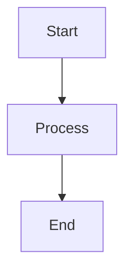
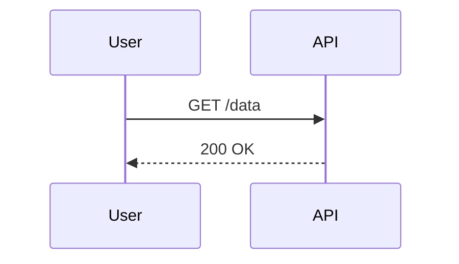

# 常见问题及解决方案

本指南说明了使用 mdPress 构建时最常遇到的问题，并提供了直接的解决方案。

## Chrome 未找到

**错误消息：**
```
Error: Chrome binary not found. Please install Chrome or Chromium
and set MDPRESS_CHROME_PATH to its path.
```

**原因：**
- 系统上未安装 Chrome/Chromium
- mdPress 无法自动检测 Chrome 位置

**解决方案：**

### 安装 Chrome

**Ubuntu/Debian：**
```bash
sudo apt-get update
sudo apt-get install -y chromium-browser
# 或
sudo apt-get install -y google-chrome-stable
```

**macOS：**
```bash
brew install chromium
# 或
brew install google-chrome
```

**Windows：**
从 https://www.google.com/chrome/ 下载

**Alpine (Docker)：**
```dockerfile
RUN apk add --no-cache chromium
```

### 手动指定 Chrome 路径

如果已安装但未自动检测：

```bash
# Linux/macOS
export MDPRESS_CHROME_PATH=/usr/bin/chromium
mdpress build --format pdf

# Windows (PowerShell)
$env:MDPRESS_CHROME_PATH="C:\Program Files\Google\Chrome\Application\chrome.exe"
mdpress.exe build --format pdf
```

查找 Chrome 位置：

```bash
# Linux
which chromium
which chromium-browser
which google-chrome

# macOS
which chromium
/Applications/Chromium.app/Contents/MacOS/Chromium

# Windows
"C:\Program Files\Google\Chrome\Application\chrome.exe"
```

### 使用 Typst 替代

如果无法安装 Chrome，使用 Typst 作为替代 PDF 后端：

```bash
# 安装 Typst（参见 https://typst.app）
# 然后使用：
mdpress build --format typst
```

Typst 不需要 Chrome 且更快。

## PDF 中 CJK 字符显示错误

**症状：**
- 中文字符显示为框或损坏文本
- 日文字符缺失或不正确
- 韩文文本渲染问题

**原因：**
- 未安装 CJK（中文、日文、韩文）字体
- 字体回退到不兼容的字体

**解决方案：**

### 安装 CJK 字体

**Ubuntu/Debian：**
```bash
sudo apt-get install -y fonts-noto-cjk fonts-noto-cjk-extra
# 或
sudo apt-get install -y fonts-wqy-microhei fonts-wqy-zenhei
```

**macOS：**
```bash
brew install font-noto-sans-cjk
```

**Alpine (Docker)：**
```dockerfile
RUN apk add --no-cache font-noto-cjk
```

**Windows：**
- 从 https://www.google.com/get/noto/ 下载 Noto Sans CJK
- 通过 Control Panel → Fonts 安装字体

### 在 book.yaml 中指定字体

```yaml
style:
  font_family: "Noto Sans CJK SC, -apple-system, BlinkMacSystemFont, sans-serif"
  # 选项：
  # - "Noto Sans CJK SC" (简体中文)
  # - "Noto Sans CJK TC" (繁体中文)
  # - "Noto Sans CJK JP" (日文)
  # - "Noto Sans CJK KR" (韩文)
```

### 验证字体安装

```bash
# 列出已安装的字体 (Linux)
fc-list | grep -i "noto"

# 验证字体可用
fc-match "Noto Sans CJK SC"
```

## 破损的内部链接

**错误消息：**
```
[WARN] Broken link: ../getting-started/setup.md (not found)
```

**原因：**
- 相对路径不正确
- 文件已重命名或移动
- 大小写敏感问题（尤其是在 Linux 上）

**解决方案：**

### 使用 mdpress validate

在构建前捕捉破损链接：

```bash
mdpress validate

# 输出：
# Validating configuration...
# Checking chapter files...
# Checking cross-references...
# [ERROR] Chapter 2 references missing file: ../api/endpoints.md
```

### 修复链接路径

验证并纠正所有相对链接：

```markdown
# 之前（破损）
See [API Reference](api-reference.md)      # 文件在 ../reference/
See [Setup Guide](./setup.md)              # 文件在 ../intro/

# 之后（正确）
See [API Reference](../reference/api.md)
See [Setup Guide](../intro/setup.md)
```

路径规则：
- 使用 `../` 上升一个目录
- 对同一目录使用 `./` 或无前缀
- 路径相对于 Markdown 文件位置

### 大小写敏感性

在 Linux/macOS 上，文件路径区分大小写：

```
# Linux/macOS：✗ 这些不同
Chapter.md
chapter.md

# Windows：这些相同

# 修复：使用精确大小写
ln -s setup.md Setup.md  # 重命名匹配
```

### 在 book.yaml 中验证

确保所有章节文件引用存在：

```yaml
chapters:
  - title: "Introduction"
    file: "intro.md"      # 检查：intro.md 存在吗？
  - title: "Getting Started"
    file: "chapters/getting-started.md"  # 检查：路径正确吗？
```

## 构建缓慢

**症状：**
- 首次构建耗时 5+ 分钟
- 后续构建也缓慢
- 资源：CPU/内存未充分利用

**原因：**
- 缓存禁用或损坏
- 非常大的章节
- 磁盘缓慢（网络挂载、旋转磁盘）
- 单核处理

**解决方案：**

### 启用缓存

缓存为默认，但验证工作正常：

```bash
# 首次构建（缓慢，创建缓存）
time mdpress build --format pdf
# 输出：real    2m15.123s

# 第二次构建（缓存，应该快速）
time mdpress build --format pdf
# 输出：real    0m3.456s

# 如果第二次构建缓慢，缓存可能禁用
```

### 强制刷新缓存

如果构建似乎过时：

```bash
mdpress build --format pdf --no-cache
```

这从头重建所有内容（缓慢）并刷新缓存。

### 开发期间使用 HTML 格式

HTML 构建比 PDF 快得多：

```bash
# 开发：快速
mdpress serve

# 最终构建：较慢但需要
mdpress build --format pdf
```

### 检查磁盘性能

测试磁盘速度：

```bash
# Linux/macOS
time dd if=/dev/zero of=test.img bs=1M count=100
# 好：>100 MB/s
# 坏：<10 MB/s（网络挂载或旧磁盘）

# Windows (PowerShell)
Measure-Command { 1..100 | % { [System.IO.File]::WriteAllText("test.txt", "x" * 1MB) } }
```

如果磁盘缓慢：
- 使用 `--cache-dir /tmp/mdpress-cache`（更快的本地磁盘）
- 避免网络挂载（NFS、SMB）用于缓存
- 在服务器上使用 SSD 存储

### 并行化（自动）

mdPress 自动使用所有 CPU 核心。如果构建不并行：

```bash
# 检查可用核心
nproc              # Linux/macOS
Get-CimInstance Win32_Processor | select ThreadCount  # Windows
```

mdPress 自动使用所有可用核心，所以多核系统应该更快。

### 减少书籍大小

对于超过 100+ 章节的书籍：

```bash
# 检查章节大小
wc -l *.md | sort -n | tail -20

# 拆分最大的章节
# 示例：将 50 页章节拆分为两个 25 页章节
# 参见 organizing-large-books.md 获取结构提示
```

## PDF 中有空白或缺失的页面

**症状：**
- 输出 PDF 有空白页
- 某些章节在 PDF 中缺失
- PDF 比预期小得多

**原因：**
- Chrome 在渲染期间崩溃
- 大型图像导致超时
- 内存耗尽
- 缓存损坏

**解决方案：**

### 增加 PDF 超时

```yaml
output:
  pdf_timeout: 300  # 从默认 120 秒增加
```

对于非常大的书籍：

```yaml
output:
  pdf_timeout: 600  # 10 分钟
```

### 强制重建

清除缓存并重建：

```bash
rm -rf .mdpress-cache/
mdpress build --format pdf --no-cache
```

### 检查图像大小

大型图像可能导致超时：

```bash
# 查找大型图像
find . -name "*.png" -o -name "*.jpg" | xargs ls -lh | awk '$5 > "1M"'

# 使用 ImageMagick 优化
convert large.png -quality 85 -resize 1920x1080 small.png
```

目标：
- 截图：不超过 500 KB
- 照片：总计不超过 2 MB
- 保持总资源不超过 50 MB

### 检查内存使用情况

在构建期间监控系统内存：

```bash
# Linux
watch -n 1 free -h

# macOS
vm_stat 1

# Windows
Get-Process mdpress | Select-Object WorkingSet
```

如果 mdPress 超过可用 RAM，将书籍拆分成较小的部分。

### 使用 Typst 后端

Typst 更轻量级，不太可能崩溃：

```bash
mdpress build --format typst
```

## Mermaid 图表错误

**错误消息：**
```
[WARN] Failed to render Mermaid diagram: Invalid diagram syntax
```

**原因：**
- Mermaid 语法不正确
- 不支持的图表类型
- 特殊字符未转义

**解决方案：**

### 验证 Mermaid 语法

在添加到书籍之前在 https://mermaid.live 测试图表：

```markdown
# 正确的语法（来自 mermaid.live）


### 支持的图表类型

- 流程图：`graph`、`flowchart`
- 序列图：`sequenceDiagram`
- 类图：`classDiagram`
- 状态图：`stateDiagram`
- ER 图：`erDiagram`
- 饼图：`pie title My Chart`

示例：

```markdown
# 序列图


### 转义特殊字符

在 YAML/TOML 中转义特殊字符：

```markdown
# 正确


### 如果 Mermaid 不可用禁用

如果 Mermaid 未安装，图表呈现为代码块：

```markdown
对于图表，安装 PlantUML 或使用图像代替：

```

## 图像不显示

**症状：**
- 图像在输出中缺失
- 破损的图像占位符
- PDF 中的文件大小错误

**原因：**
- 图像路径不正确
- 图像文件未找到
- 不兼容的格式
- 路径有空格（未转义）

**解决方案：**

### 检查图像路径

验证路径正确且相对：

```markdown
# 正确（相对路径）


# 不正确（绝对路径，无法工作）


# 不正确（URL，仅在 HTML 中工作）

```

### 转义包含空格的路径

使用百分比编码或引号：

```markdown
# 问题（文件名有空格）
       # 可能无法工作

# 更好（使用下划线）
       # 到处工作

# 或百分比编码
     # 工作
```

### 使用支持的格式

- **PDF 输出**：PNG、JPEG、SVG、GIF
- **HTML 输出**：PNG、JPEG、SVG、GIF、WebP
- **ePub 输出**：PNG、JPEG、SVG

```markdown
# 使用这些格式
        # 矢量，无限缩放
     # 无损，适合 UI
          # 有损，适合照片

# 避免用于 PDF
    # PDF 不支持 WebP
```

### 使用 mdpress validate 验证

```bash
mdpress validate

# 输出包括图像检查：
# [INFO] Checking images...
# [ERROR] Image not found: ../assets/missing.png
```

### 检查文件权限

确保 mdPress 可以读取图像文件：

```bash
# Linux/macOS
ls -l assets/*.png
# 应显示：-rw-r--r--（可读）

chmod 644 assets/*.png  # 修复权限如需要
```

## 链接验证和 mdpress validate

**命令：**
```bash
mdpress validate
```

**检查：**
- 配置文件语法
- 所有章节文件存在
- 所有图像文件存在
- 交叉引用路径有效
- GLOSSARY.md 和 LANGS.md 格式（如存在）

**示例输出：**
```
Validating configuration...
✓ Config file syntax OK
✓ All 12 chapters exist
✓ 24 images found
✓ Cross-references valid
✓ No broken links

Validation successful!
```

**修复问题：**
```bash
# 运行验证
mdpress validate

# 修复每个问题
# 1. 缺失的章节文件：添加文件
# 2. 破损的图像路径：纠正相对路径
# 3. 无效的章节引用：修复 book.yaml

# 验证修复
mdpress validate
```

## 升级问题

**症状：**
- 升级命令失败
- 备份文件被遗留
- 升级后新的二进制文件无法正常工作
- 检查更新时出现网络错误

**原因：**
- 文件权限问题
- 网络连接问题
- 磁盘空间不足
- 不兼容的平台或架构

**解决方案：**

### 权限被拒绝

如果出现"权限被拒绝"错误：

```bash
# 检查文件权限
ls -l $(which mdpress)

# 使其可写（可能需要 sudo）
sudo chmod u+w $(which mdpress)

# 再次尝试升级
mdpress upgrade
```

### 网络错误

如果升级命令无法连接：

```bash
# 检查互联网连接
ping github.com

# 如果在代理后，设置它
export HTTPS_PROXY=https://proxy.example.com:8080
mdpress upgrade

# 使用详细输出尝试
mdpress upgrade --verbose
```

### 备份恢复

如果升级失败并遗留备份：

```bash
# 列出二进制文件和备份
ls -la $(which mdpress)*

# 如果新的二进制文件能工作，删除备份
rm $(which mdpress).backup

# 如果新的二进制文件损坏，恢复
mv $(which mdpress).backup $(which mdpress)
mdpress --version
```

### 检查磁盘空间

大型下载需要足够的磁盘空间：

```bash
# 检查主目录中的可用空间
df -h ~

# 如果空间不足，先使用 --check
mdpress upgrade --check
```

### 验证二进制文件正常工作

升级后，始终验证新版本：

```bash
mdpress --version
mdpress doctor
```

详细故障排除，参见 [upgrade.md](../../../commands/upgrade_zh.md#常见问题和解决方案)。

## 性能故障排除

参见 [performance.md](../best-practices/performance.md) 了解构建速度问题。

## 其他帮助

对于这里未涵盖的问题：

```bash
# 为详细诊断启用详细输出
mdpress build --verbose --format pdf

# 检查系统就绪情况
mdpress doctor

# 列出可用的主题
mdpress themes list

# 验证配置
mdpress validate
```

获取错误或详细支持，请访问：
- 仓库：https://github.com/yeasy/mdpress
- 问题：https://github.com/yeasy/mdpress/issues
- 文档：https://github.com/yeasy/mdpress
