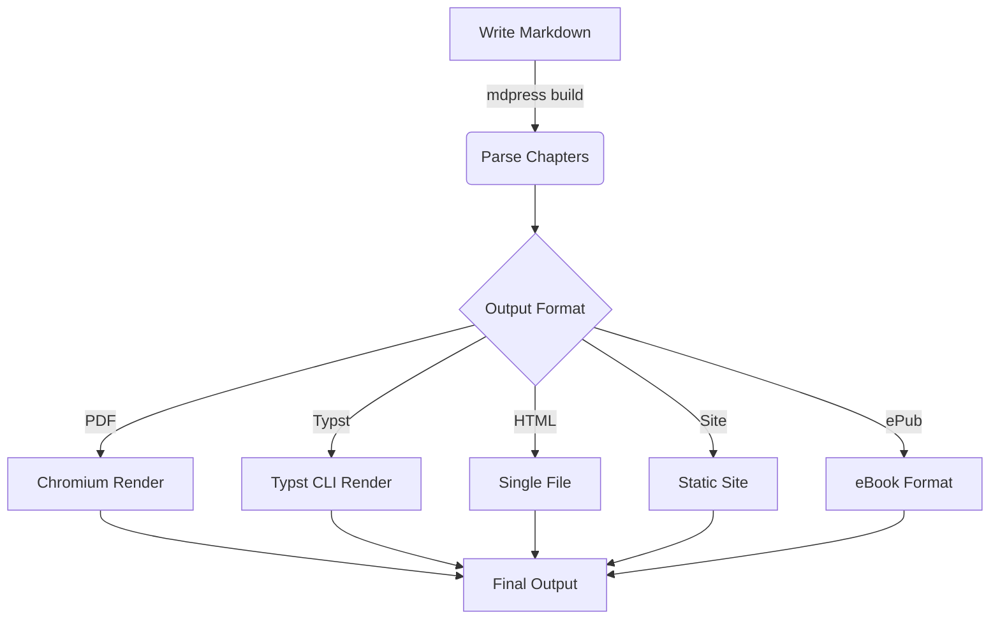
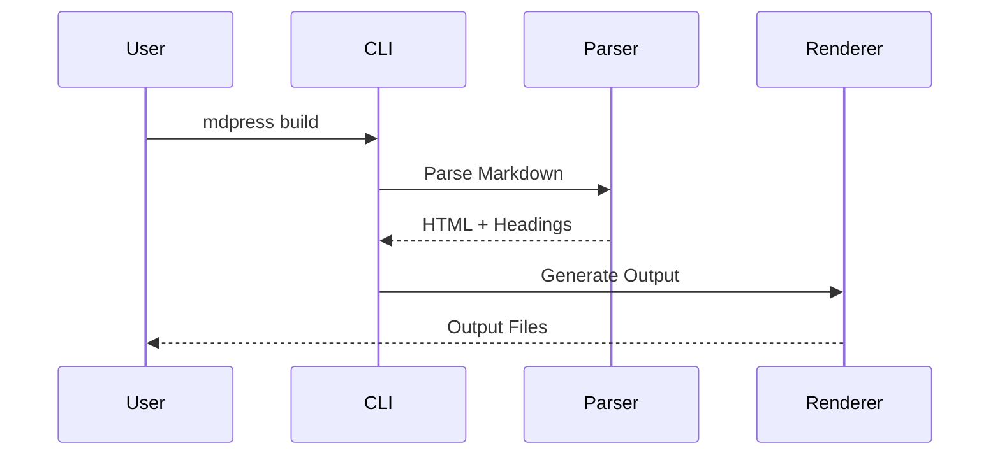

# Chapter 2: Advanced Usage

This chapter covers advanced mdpress features for creating professional-grade PDF books.

## 2.1 Custom Themes

mdpress comes with three built-in themes:

- **technical**: Technical docs style, ideal for programming books
- **elegant**: Elegant literary style, ideal for literary works
- **minimal**: Minimalist style, ideal for notes and memos

Switch themes in `book.yaml`:

```yaml
style:
  theme: "elegant"
```

### Creating Custom Themes

You can create your own theme file (YAML format):

```yaml
name: my-theme
font_family: "Source Han Sans SC"
font_size: "11pt"
code_theme: "dracula"
colors:
  text: "#2d2d2d"
  heading: "#c0392b"
  link: "#2980b9"
```

## 2.2 Cross References

mdpress supports cross-referencing of figures, tables, and sections.

### Figure References

```markdown
{#fig-architecture}

As shown in {{ref:fig-architecture}}...
```

### Table References

```markdown
| Col1 | Col2 |
|------|------|
| a    | b    |
{#tab-comparison}

See {{ref:tab-comparison}}.
```

## 2.3 Multi-file Organization

For large book projects, organize files by chapter:

```
my-book/
├── book.yaml
├── cover.png
├── preface.md
├── part1/
│   ├── chapter01.md
│   ├── chapter02.md
│   └── images/
│       ├── fig01.png
│       └── fig02.png
├── part2/
│   ├── chapter03.md
│   └── chapter04.md
└── appendix/
    └── references.md
```

## 2.4 Headers & Footers

Custom headers and footers support template variables:

| Variable | Description |
|----------|-------------|
| `{{.Book.Title}}` | Book title |
| `{{.Book.Author}}` | Author |
| `{{.Chapter.Title}}` | Current chapter title |
| `{{.PageNum}}` | Current page number |

Configuration example:

```yaml
style:
  header:
    left: "{{.Book.Title}}"
    right: "{{.Chapter.Title}}"
  footer:
    center: "Page {{.PageNum}}"
```

## 2.5 Mermaid Diagrams

mdpress supports Mermaid diagrams for visualizing workflows and architectures:





## 2.6 Footnotes[^1]

mdpress fully supports Markdown footnote syntax. Footnotes are automatically numbered and displayed at the bottom of the page or end of the chapter.

[^1]: This is a footnote example.

## 2.7 Summary

After this chapter, you have mastered most of the advanced features of mdpress. For more details, refer to the project documentation.
